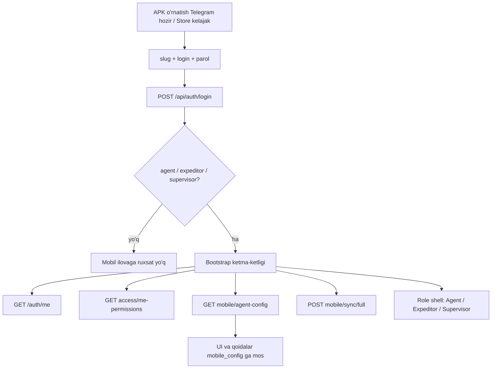
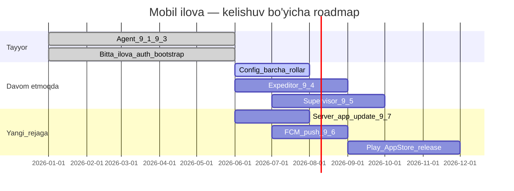

> **✅ YAKUNLANDI (2026-06-26)** — [docs/BITTA_ILOVA_YAKUNLANDI.md](../../docs/BITTA_ILOVA_YAKUNLANDI.md)

# Bitta ilova arxitekturasi — audit va to‘ldirish rejasi

## Kelishuv vs hozirgi holat (qisqa javob)

**Ha, asosiy g‘oya rejada va kodda bir xil yo‘nalishda.** [MOBILE_APP_TOLOQ_REJA_UZ.md](mobile/MOBILE_APP_TOLOQ_REJA_UZ.md) §1.4 va §10 aynan siz tasvirlagan oqimni belgilaydi:

Bu oqim kodda amalga oshirilgan: [auth_provider.dart](mobile/lib/features/auth/auth_provider.dart) `_bootstrap()`, [app_router.dart](mobile/lib/routing/app_router.dart) `_HomePage` + `role_guard.dart`, [session.dart](mobile/lib/core/auth/session.dart) + [mobile_config.dart](mobile/lib/core/config/mobile_config.dart).

---

## Nima to‘liq ishlaydi (kelishuvga mos)

| Talab | Holat | Asosiy fayllar |
|-------|-------|----------------|
| Bitta ilova, barcha mobil rollar | Tayyor | `mobile/pubspec.yaml`, `app_router.dart` |
| Login → server rol aniqlaydi | Tayyor | `auth_api.dart`, `auth.service.ts` |
| `app_access` tekshiruvi | Tayyor | login + `/auth/me` |
| Serverdan konfiguratsiya yuklash | Tayyor (agent kuchli) | `GET /api/:slug/mobile/agent-config` |
| Veb paneldan sozlash | Tayyor | [agent-configurations-dialog.tsx](frontend/components/staff/agent-configurations-dialog.tsx) |
| Bootstrap + to‘liq sinxron | Tayyor (agent) | `sync/full`, SQLite |
| Rol bo‘yicha UI / navigatsiya | Tayyor | `role_guard.dart`, `AgentShell` / expeditor / supervisor bottom nav |
| Konfig o‘zgarishi keyin yangilanish | Qisman | agent: drawer/resume/resync; boshqalar: faqat login/restore |

**Agent (FAZA 9.1–9.3)** — [AGENT_REJA_HOLATI.md](mobile/AGENT_REJA_HOLATI.md) bo‘yicha **yakunlangan**: veb `mobile_config` → backend merge → mobil policy fayllar orqali UI/qoidalarga qo‘llanadi.

---

## Nima hali to‘liq emas (kelishuvdan farq)

### 1. Barcha rollar uchun teng moslashuv

| Rol | Chuqurlik | Gap |
|-----|-----------|-----|
| **Agent** | Production | Ba’zi `misc`/`supervision` kalitlari hali UI da yo‘q ([MOBILE_CONFIG_GAP_PLAN.md](mobile/MOBILE_CONFIG_GAP_PLAN.md)) |
| **Expeditor** | MVP shell | To‘lov/qaytarish stub; `expeditor.*` config deyarli qo‘llanmaydi |
| **Supervisor** | MVP shell | Dashboard qisman mock; xarita/checklist to‘liq emas |

Rejada bu **FAZA 9.4–9.5** sifatida belgilangan — hali bajarilmagan, lekin **bitta ilova ichida**, alohida APK emas.

### 2. Konfiguratsiyani doimiy server bilan sinxron holatda ushlab turish

Hozir:
- Agent: app resume, drawer ochilganda `refreshMobileConfig()` — yaxshi
- Expeditor/Supervisor: faqat login/restore — admin sozlamani o‘zgartirsa, foydalanuvchi ilovani qayta ochmaguncha ko‘rmaydi

**Rejaga qo‘shish:** barcha rollar uchun umumiy `AppLifecycle` + periodic config refresh (masalan, har 15 daqiqa yoki har sync oldidan).

### 3. Serverdan avtomatik ilova yangilanishi — hozir **YO‘Q**

Mavjud faqat **telemetriya**:
- Mobil login/presence/sync da `apk_version` yuboradi → `users.apk_version` saqlanadi
- Veb panelda «Версия APK» ko‘rinadi
- **Majburiy yangilash, versiya siyosati, APK/Store havolasi — yo‘q**

[MOBILE_APP_TOLOQ_REJA_UZ.md](mobile/MOBILE_APP_TOLOQ_REJA_UZ.md) FAZA **9.6** faqat «FCM + store release» deb yozilgan; siz so‘ragan **server boshqariladigan yangilanish** alohida modul sifatida rejaga kiritilishi kerak.

---

## Taklif: yangi FAZA 9.7 — Server boshqariladigan yangilanish

Sizning hozirgi va kelajak modeli:

| Bosqich | Tarqatish | Server roli |
|---------|-----------|-------------|
| **Hozir** | Telegram orqali APK sideload | Versiya tekshiruvi + «yangi APK mavjud» + download URL |
| **Kelajak** | Google Play + App Store | `min_version` / `latest_version` + Store havolasi + ixtiyoriy In-App Update |

### Backend (yangi)

- `Tenant.settings` yoki alohida `app_release_policy` jadvali:
  - `min_version`, `latest_version`, `force_update`, `download_url`, `store_url_android`, `store_url_ios`, `release_notes`
- Endpoint: `GET /api/mobile/app-release` (tenant-slugsiz yoki login javobida)
- Login / `agent-config` javobiga qo‘shish: `{ update: { required, optional, url, notes } }`
- Semver taqqoslash (`3.0.0` vs `min_version`)

Fayllar: [auth.service.ts](backend/src/modules/auth/auth.service.ts), [mobile.route.ts](backend/src/modules/mobile/mobile.route.ts), yangi `app-release.service.ts`, veb admin UI.

### Mobil (yangi)

- Startup/login gate: majburiy yangilash dialogi (bloklaydi)
- Ixtiyoriy yangilash: «Keyinroq» / «Yangilash»
- Android hozir: server `download_url` → brauzer/APK installer
- Kelajak Android: `in_app_update` (Play)
- iOS: App Store deep link (OTA APK emas — Apple qoidasi)

Fayllar: yangi `app_update_service.dart`, `auth_provider.dart` bootstrap oldidan tekshiruv.

### Veb admin

- `Настройки → Мобильное приложение` (yoki tenant profile):
  - Minimal versiya, oxirgi versiya, majburiy yoqish, APK URL, Play/App Store linklar
  - Agentlar jadvalidagi `apk_version` ustunidan «kim eskirgan» ko‘rinishi

### FCM (ixtiyoriy, 9.6 bilan birga)

- `device_tokens` migratsiyasi + push: «Yangi versiya 3.1.0 — yangilang»
- Hozir FCM stub — [mobile.service.ts](backend/src/modules/mobile/mobile.service.ts) `registerFcmToken` jadvalsiz

---

## Umumiy roadmap (kelishuv + yangi talab)

---

## Xulosa (sizning savolingizga to‘g‘ridan-to‘g‘ri)

| Savol | Javob |
|-------|-------|
| Bitta ilova, login → rol → konfig → moslashuv rejada bormi? | **Ha** — hujjat va kod mos |
| Hozir shunday ishlayaptimi? | **Agent uchun — ha.** Expeditor/supervisor — qisman |
| Telegram APK → keyin Store modeli mosmi? | **Ha** — arxitektura buni qo‘llab-quvvatlaydi |
| Serverdan avtomatik yangilanish rejada bormi? | **Hozir yo‘q** — faqat versiya hisobi; **FAZA 9.7 sifatida qo‘shish kerak** |
| Hujjat yangilanganmi? | [MOBILE_APP_TOLOQ_REJA_UZ.md](mobile/MOBILE_APP_TOLOQ_REJA_UZ.md) (2026-05-29) eskirgan — Flutter allaqachon mavjud; audit natijasini shu hujjatga yangilash kerak |

---

## Keyingi amaliy qadamlar (implementatsiya uchun)

1. **Hujjat yangilash** — `MOBILE_APP_TOLOQ_REJA_UZ.md` §14 va §17 ni hozirgi holat + FAZA 9.7 bilan yangilash
2. **FAZA 9.7 MVP** — backend versiya siyosati + login gate + veb admin + APK download dialog (Telegram workflow uchun)
3. **Config refresh** — barcha rollar uchun `refreshMobileConfig()` lifecycle
4. **FAZA 9.4–9.5** — expeditor/supervisor to‘liq oqim + `expeditor.*` / `supervision.*` config enforcement
5. **FAZA 9.6** — FCM + Play/App Store release pipeline
