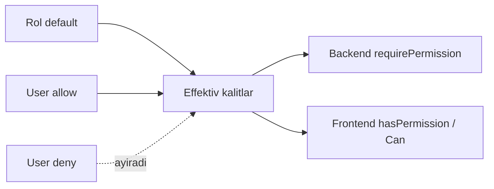

> **✅ YAKUNLANDI (2026-06-26)** — [docs/DOSTUP_CRUD_YAKUNLANDI.md](../../docs/DOSTUP_CRUD_YAKUNLANDI.md)

# Dostup tizimini CRUD modeliga o'tkazish va tekshiruvni ulash rejasi

## Hozirgi holat (qisqacha audit)
- Ruxsatlar **tekis on/off kalitlar** (~343 legacy + 18 zamonaviy). CRUD struktura sifatida yo'q — `clients.dobavlenie_klienta` kabi kalit nomida yashirin.
  - Manba: [backend/src/modules/access/legacy-permissions.generated.ts](backend/src/modules/access/legacy-permissions.generated.ts), [backend/src/modules/access/permission-catalog.ts](backend/src/modules/access/permission-catalog.ts)
- Backendda amalda faqat ~3-5 kalit tekshiriladi (`access.manage`, `reports.view/export`, dashboard, mobile). Qolgani **ulanmagan** (kodda "follow-up" deb belgilangan): [backend/src/modules/access/legacy-permission-labels.ts](backend/src/modules/access/legacy-permission-labels.ts).
- Tekshiruv funksiyalari tayyor: `requireRoles` / `requirePermission` / `requireAnyPermission` — [backend/src/modules/auth/auth.prehandlers.ts](backend/src/modules/auth/auth.prehandlers.ts).
- Frontend deyarli hamma joyda faqat **rol** bo'yicha tekshiradi (`role === "admin"`), `useEffectiveRole()` — [frontend/lib/auth-store.ts](frontend/lib/auth-store.ts); umumiy `hasPermission()` helper yo'q.
- Yetishmayotgan/kam qamralgan bo'limlar: **Sklad** (11 sahifa, 2 kalit), `orders/automation`, `routes`/GPS-tracking, **Pivot**, **Audit**, **Finance**, work-slots.

## Maqsadli model
Kalit konvensiyasi: `<modul>.<bo'lim>.<amal>`, amal turlari:
- Asosiy CRUD: `view` (Ko'rish), `create` (Yaratish), `update` (O'zgartirish), `delete` (O'chirish)
- **Alohida holat tiplari** (foydalanuvchi alohida so'ragan, har biri mustaqil checkbox):
  - `copy` — Ma'lumotni ko'chirib olish (nusxalash / Excel'ga chiqarish / klonlash)
  - `activate` — Aktiv qilish
  - `deactivate` — Neaktiv qilish
- Qo'shimcha (kerak bo'lganda): `import`, `status`, `assign`, `approve`

Muhim: `activate` va `deactivate` `update` yoki bitta umumiy `status` ostiga **birlashtirilmaydi** — har biri alohida ruxsat tipi (chunki ko'pincha bir rolga faqat aktiv qilishga ruxsat berib, neaktiv qilishni taqiqlash kerak bo'ladi). `copy` ham `view`/`export` dan ajratiladi.

Bu UIda har bir bo'lim bitta qator, ustunlar = amal tiplari (checkbox grid): `Ko'rish | Yaratish | O'zgartirish | O'chirish | Ko'chirib olish | Aktiv | Neaktiv | (qo'shimcha)` — hozirgi uzun tekis ro'yxat o'rniga.

## Bo'limlar bo'yicha amal tiplari (maqsad)
Har bir bo'limga kamida `view` + tegishli CRUD + (kerakli joyda) `copy`/`activate`/`deactivate` beriladi:
- Заказы: view/create/update/delete/status/copy/assign (возврат, обмен, отказ, статусы; `copy` = чек/накладные Excel, заказни nusxalash)
- Клиенты: view/create/update/delete/import/copy/assign/activate/deactivate (профиль, QR, оборудование, объединение; QR statuslari va mijozni aktiv/neaktiv qilish alohida)
- Накладные: view/create/update/status/copy (сборочные/отгрузочные/возвратные; `copy` = Excel 217/520)
- Касса: view/create/update/delete/approve/copy (оплаты, расходы, балансы, заявки, курс; касса yopish = `status`)
- Склад: view/create/update/delete/transfer/copy (склады, блоки, остатки, поступление, перемещение, корректировка, списание, материальный отчёт) — **yangi kalitlar**
- Поставщики: view/create/update/delete/copy (поставщики, оплаты, балансы, акт сверки)
- Планы/Отчёт: view/copy/approve (отчёты + установка планов; `copy` = Excel/eksport, `approve` = utverditь)
- Пользователи (staff): view/create/update/delete/copy/assign/activate/deactivate (har bir rol + KPI/зарплаты/табель/задачи; сотрудникни aktiv/neaktiv qilish va сеанс tugatish alohida)
- Настройки: view/create/update/delete/import (har bir spravochnik; ba'zilarida activate/deactivate)
- GPS/Routes: view/update (доступ, последовательность, треки) — **yangi**
- Dashboard/Pivot/Audit/Finance/Access: view + `copy` (eksport) (+ Access: manage)

Eslatma: `copy`, `activate`, `deactivate` faqat shu amal mantiqan mavjud bo'lgan bo'limlarda ustun sifatida ko'rsatiladi (ortiqcha bo'sh checkboxlarsiz). Katalogdagi har bir bo'lim qaysi amal tiplarini qo'llashini metadata bilan belgilaymiz.

## Rol biriktirish (default) yaxshilash
- Har bir rol uchun bo'lim×amal default to'plamini qayta belgilash (masalan: agent → заказы/клиенты view+create+copy, склад/касса yo'q; cashier → касса CRUD; skladchik → склад CRUD; auditor → faqat view + copy + audit; admin → hammasi).
- `activate`/`deactivate` ni alohida berish imkoniyatidan foydalanish: masalan supervisor → клиенты/staff `activate` ha, `deactivate` yo'q; faqat admin/director → `deactivate`.
- Manba: `setRolePermissions` va default'lar — [backend/src/modules/access/rbac.roles.ts](backend/src/modules/access/rbac.roles.ts), [backend/src/lib/tenant-user-roles.ts](backend/src/lib/tenant-user-roles.ts).

## Texnik bosqichlar

### Faza 0 — Poydevor (struktura + migratsiya)
- Amal tiplari ro'yxatini (enum) belgilash: `view, create, update, delete, copy, activate, deactivate, import, status, assign, approve`. Har bir tipga RU/UZ yorliq beriladi.
- Yangi struktura kataloglar fayli: har bir bo'lim + o'sha bo'lim **qaysi amal tiplarini qo'llashi** (jumladan `copy`/`activate`/`deactivate` kerak yoki yo'qligi) metadata bilan. `permission-catalog.ts` ni shu modelga kengaytirish.
- Eski kalitlarni yangi `<modul>.<bo'lim>.<amal>` kalitlarga **moslashtirish jadvali** (mapping) yozish (masalan `..._aktivirovat` → `.activate`, `..._deaktivirovat` → `.deactivate`, `skachat_excel/klonirovat` → `.copy`), mavjud user/role biriktirishlarni yo'qotmaslik uchun migratsiya skripti (`backend/scripts/`).
- Effektiv hisoblash o'zgarmaydi: role ∪ allow − deny — [backend/src/modules/access/rbac.resolve.ts](backend/src/modules/access/rbac.resolve.ts).

### Faza 1 — Yuqori xavfli bo'limlar (Касса, Склад, Заказы, Доступ)
- Katalogga shu bo'limlarning to'liq CRUD kalitlarini qo'shish (Sklad uchun yetishmaganlarini ham).
- Backend route'larga `requirePermission`/`requireAnyPermission` ulash: orders, stock, payments/cash-desks, suppliers write yo'llari (`requireRoles` yoniga qo'shiladi). Namuna: [backend/docs/rbac-route-pattern.md](backend/docs/rbac-route-pattern.md).

### Faza 2 — Клиенты, Накладные, Поставщики
- CRUD kalitlar + route enforcement.

### Faza 3 — Пользователи (staff), Настройки, Планы/Отчёт, GPS/Routes
- staff modulidagi har bir rol uchun CRUD; settings spravochniklari; reports/plans; GPS va routes (yangi kalitlar).

### Faza 4 — Frontend gating + UIni qayta tuzish
- Umumiy helper: `usePermissions()` + `hasPermission(key)` + `<Can permission="...">` komponenti (effektiv kalitlar `/access/me-permissions` dan, hozir faqat [frontend/lib/use-access-module-gate.ts](frontend/lib/use-access-module-gate.ts) da ishlatilgan).
- Nav va sahifalardagi `role === "admin"` tekshiruvlarini `hasPermission` ga ko'chirish — [frontend/components/dashboard/nav-config.ts](frontend/components/dashboard/nav-config.ts), `app/(dashboard)/**/page.tsx`.
- Dostup UIni **CRUD grid** ko'rinishiga o'tkazish (bo'lim qatori × amal ustunlari: `Ko'rish | Yaratish | O'zgartirish | O'chirish | Ko'chirib olish | Aktiv | Neaktiv | qo'shimcha`). Bo'lim qo'llamaydigan tip uchun katakcha ko'rsatilmaydi. Per-user matritsada har katak 3 holatli (inherit/allow/deny) bo'lib qoladi: [frontend/components/access/access-role-defaults-workspace.tsx](frontend/components/access/access-role-defaults-workspace.tsx), [frontend/components/access/access-user-detail-panel.tsx](frontend/components/access/access-user-detail-panel.tsx).

### Faza 5 — Yetishmayotgan bo'limlar va tozalash
- Pivot, Audit, Finance, automation, work-slots uchun kalitlar; eski ishlatilmaydigan kalitlarni olib tashlash; audit log (`access_logs`) to'liqligini tekshirish.

## Tekshirish
- Har faza oxirida: bitta rol uchun ruxsatni o'chirib, tegishli endpoint 403 berishini va frontendda tugma yashirilishini tekshirish.

**Yakuniy (2026-06-26):** `npm run dostup:verify` — **35/35** test (pure + integratsiya + RBAC enforcement).
