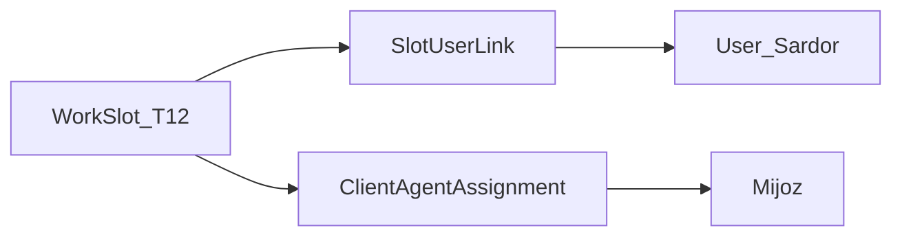

> **✅ YAKUNLANDI (2026-06-26)** — [docs/WORK_SLOTS_YAKUNLANDI.md](../../docs/WORK_SLOTS_YAKUNLANDI.md)

# Ishchi o‘rni — to‘liq reja (v1, hujjat asosida)

Manba: `SALEC_IshchiOrni_Reja_v1.docx`  
Asosiy prinsip: **joy doimiy — odam almashadi — tarix o‘zgarmaydi**

---

## A. Oddiy til — nima qilamiz?

### Uchta tushuncha

| Tushuncha | Ma’nosi |
|-----------|---------|
| **Ishchi o‘rni (WorkSlot)** | Doimiy joy: stiker kodi (`T-12`), filial, kassa/sklad/hudud |
| **Akkaunt** | Bugun shu joyda ishlayotgan odam |
| **Tarix** | Eski zakaz va to‘lovlar eski odamda; yangilari yangi odamda |

**Misol.** Stiker `T-12`. Ali ketdi, Sardor keldi. Stiker o‘zgarmaydi. Eski zakazlar — Ali, yangilari — Sardor.

### Aniq qoidalar (biznes)

1. **Qulflash** — shartnoma yoki maxsus do‘kon: tizim agentni o‘zi o‘zgartirmaydi (`contract`). Oddiy qo‘lda tanlash — ogohlantirish bilan (`manual`). Qulflash yo‘q — hudud qoidasiga bo‘ysunadi (`none`).
2. **Bitta kod — bitta yo‘nalish** — chakana `T-12`, optom `T-13` (alohida kodlar).
3. **Bitta filial** — agent, inkasator, yetkazuvchi, omborchi faqat o‘z filialida yozadi; nazoratchi va boshqaruv ko‘p filialni ko‘radi.
4. **Bitta kassa — bitta inkasator** — bir vaqtda bitta odam.
5. **Ikki qoida mos kelsa** — avtomatik agent bermaydi; supervisor qaror qiladi (`pending_review`).
6. **Slot kodi o‘zgarmaydi** — stiker bosilgandan keyin kod qayta yozilmaydi.

### Xodim almashganda (4 qadam)

1. Kassa/sklad boshqa joy bilan ustma-ust emasligi.
2. Nechta mijoz o‘zgaradi (qulflanganlar tashqari).
3. Eski odam joydan chiqariladi, yangisi qo‘yiladi (bitta operatsiya — yarmi qolmasin).
4. Test zakaz — tarix to‘g‘rimi.

### Tasdiqlangan savollar (hujjatdan)

- Har yo‘nalish uchun **alohida kod** — ha.
- Ikki agent mos kelsa — **odam hal qiladi** — ha.

---

## B. Hozirgi loyiha — nima bor, nima yo‘q

| Narsa | Holat |
|-------|--------|
| Mijozda agent slotlari (1–10) | Bor — asos sifatida ishlatiladi |
| Filial, ko‘p filial (supervisor) | Bor — `User.branch`, `UserBranchLink` |
| Ombor–xodim bog‘lanishi | Bor |
| Stiker kodi (`T-12`, `T-13`, …) | **Bor** — `WorkSlot.slot_code` (Q-01: PATCH bilan o‘zgarmaydi) |
| Ishchi o‘rni jadvali (WorkSlot) | **Bor** — migratsiya `20260601120000_work_slots_foundation`, modul `/work-slots` |
| Qulflash / pending agent | **Bor** — `lock_type`, `auto_assign_status`, pending UI |
| Xodim almashish tarixi (slot bo‘yicha) | **Bor** — `slot_audit_entries`, assign/unassign API |
| Kassa — bitta inkasator | **Bor** — `CASH_DESK_OCCUPIED`, checklist |
| Prod backfill skripti | Skript tayyor; **staging/prodda bir marta ishga tushirish** — v2 todo `prod-backfill` |
| FE yupqalash (zakaz lock badge, staff slot tanlash) | Qisman — v2 todo `fe-order-lock-ui`, `fe-staff-slot-picker` |
| Report Builder slot kesimi | Reja — v2 todo `report-builder-slot` |
| Mobil Flutter UI | Repoda hali yo‘q; API + web ko‘rsatkich — v2 todo `mobile-ui-slot` |
| 1C / Excel | Kelajak — v2 todo `future-1c-excel` |

Muhim: yangi jadvallar **eski kodni buzmaydi** — additive migratsiya; backfill mavjud agentlarga slot yaratadi.

---

## C. Yangi tuzilma (qisqa)

- **WorkSlot** — `slot_code`, filial, yo‘nalish, tur (agent / inkasator / …).
- **SlotUserLink** — kim qachon shu joyda ishlagan (`started_at`, `ended_at`; o‘chirilmaydi).
- **ClientAgentAssignment** ga qo‘shiladi: `lock_type`, `auto_assign_status`, `work_slot_id`.
- **SlotAuditEntry** — kim kimga almashtirgan (alohida tarix).

---

## D. Backend va ekranlar (hujjat bo‘yicha)

### Yangi modul: `backend/src/modules/work-slots/`

Asosiy vazifalar: slot ro‘yxati, yaratish, xodim biriktirish/almashtirish, tarix, qulflash, pending ro‘yxat.

Asosiy yo‘llar (qisqa):

- `GET/POST /work-slots` — ro‘yxat, yaratish
- `GET/PATCH /work-slots/:id` — ko‘rish, tahrirlash (kod o‘zgarmaydi)
- `POST /work-slots/:id/assign` — xodim qo‘yish/almashtirish
- `GET /work-slots/:id/history` — tarix
- `GET /work-slots/:id/checklist` — almashtirish oldidan tekshiruv
- `PATCH /client-agent-assignments/:id/lock` — qulflash
- `GET .../pending` va `POST .../resolve` — kutilayotgan agentlar

### Mavjud kodga kichik o‘zgarishlar

- [backend/src/modules/staff/staff.service.ts](backend/src/modules/staff/staff.service.ts) — slot bandligi haqida ogohlantirish
- [backend/src/modules/cash-desks/cash-desks.service.ts](backend/src/modules/cash-desks/cash-desks.service.ts) — kassa bandligi
- [backend/src/modules/orders/orders.service.ts](backend/src/modules/orders/orders.service.ts) — qattiq qulflashda ogohlantirish

### Frontend (yangi)

- `work-slots` — ro‘yxat va batafsil
- Xodim biriktirish oynasi, 4 qadamli checklist (skip yo‘q)
- Mijoz kartasida: hozirgi mas’ul + qulflash holati
- Dashboard: pending soni

---

## E. Buzilmasin degan 8 qoida

| # | Qoida |
|---|--------|
| Q-01 | Slot kodi (`T-12`) keyin o‘zgartirilmaydi |
| Q-02 | Eski xodim–joy bog‘lanishi o‘chirilmaydi, faqat tugatiladi |
| Q-03 | `contract` qulflash — agent o‘zi o‘zgarmaydi |
| Q-04 | Bitta kassa — bitta aktiv inkasator |
| Q-05 | Ikki qoida mos kelsa — `pending_review`, avtomatik bermaslik |
| Q-06 | Maydon xodimi — bitta filialda yozish |
| Q-07 | Bitta slot — bitta tur (agent yoki inkasator, aralash emas) |
| Q-08 | Almashtirish bitta operatsiyada — yarmi qolmasin |

---

## F. Bosqichlar va vaqt

| Faza | Vaqt (taxminan) | Natija |
|------|-----------------|--------|
| **1. Bazalar** | 5–7 ish kuni | Yangi jadvallar, maydonlar; eski testlar o‘tadi |
| **2. Backend** | 10–15 ish kuni | API, lock, kassa, pending |
| **3. Frontend** | 10–15 ish kuni | Sahifalar, checklist, badge |
| **Jami** | ~5–7 hafta | Productionda slot orqali xodim almashishi |

### Faza 1 — birinchi ishlar

1. `work_slots`, `slot_user_links`, `slot_audit_entries` yaratish  
2. `client_agent_assignments`: `lock_type`, `auto_assign_status`, `work_slot_id`  
3. Stagingda migratsiya, regression test  
4. Backfill skript (mavjud agentlardan slot yaratish)

---

## G. Kelajak uchun eslatma

- KPI: kim qachon ishlagan — `SlotUserLink` sanalari  
- Mobil: agent o‘z `T-12` kodini ko‘radi  
- Hisobot: slot bo‘yicha kesim  
- Tashqi tizim (masalan 1C): `slot_code` kalit, o‘zgarmas

---

## H. Eski qisqa reja bilan farq

Oldingi [ishchi_o‘rni_to‘liq_logika](.cursor/plans/ishchi_o‘rni_to‘liq_logika_8744b1d4.plan.md) faqat biznes edi. **Ushbu v1** hujjatdagi nomlar va bosqichlarni qo‘shadi: **WorkSlot** (Workplace emas), **SlotUserLink**, aniq migratsiya va API ro‘yxati.
