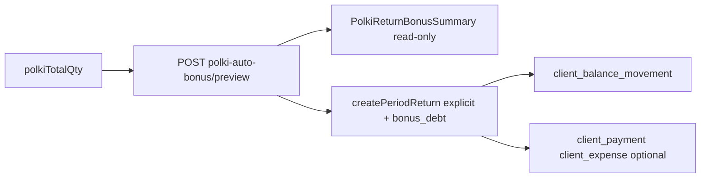

# Polki: to‘liq avto bonus va o‘qiladigan «Бонус / баланс»

## Maqsad

[Erkin «Создать возврат с полки»](frontend/components/orders/order-create/view/polki-shelf-return/return-order-data-column.tsx) rejimida:

- Foydalanuvchi faqat **«Дата · всего к возврату»** ustunida miqdor kiritadi.
- **«Бонус / баланс»** ustuni — input/select/checkbox **yo‘q**, faqat hisoblangan taqsimot (oplata, bonus omborga, mahsulot nomlari, peresort, qarz summasi).
- **«Авто-бонус»** bloki (checkbox, «Пересчитать», «Применить») olib tashlanadi — hammasi doim ishlaydi.
- **«Долг бонус»** mijozning **[Балансы клиентов](frontend/components/clients/client-balance-ledger-view.tsx)** jadvalida **Долг** ustunida, tur sifatida **«Долг бонус»** ko‘rinishi kerak (hozir faqat `client_balance_movements` + `note: "Долг бонус"`).

---

## 1. Frontend: doim yoqilgan preview (toggle yo‘q)

**Fayl:** [`use-polki-auto-bonus.ts`](frontend/components/orders/order-create/hooks/use-polki-auto-bonus.ts)

| Olib tashlash | Qilish |
|---------------|--------|
| `enabled` / `applied` / `setPolkiAutoBonusEnabled` | Preview `isPolkiFree && canShowPolkiGrid && clientId && qty>0` da **doim** `useQuery` |
| `applyPolkiAutoBonusToRows` (total qty ni qayta yozadi) | `useEffect`: preview kelganda **faqat** `explicitByPairKey` + avto-peresort map yangilansin; **`polkiTotalQty` o‘zgarmasin** |
| Submit blok: `!polkiAutoBonusApplied` | Preview tayyor bo‘lsa submit; preview xato/bo‘sh bo‘lsa aniq xabar |

Debounce: preview `queryKey` o‘zgarishida ~300ms (yoki `staleTime` + `placeholderData`) — har belgida spam bo‘lmasin.

**Olib tashlash / soddalashtirish:** [`return-auto-bonus-block.tsx`](frontend/components/orders/order-create/view/polki-shelf-return/return-auto-bonus-block.tsx) — `return-order-data-column.tsx` dan import; kerak bo‘lsa faqat **umumiy qarz + ogohlantirishlar** strip (ixtiyoriy, jadvalsiz).

**State tozalash** [`use-order-create.ts`](frontend/components/orders/order-create/hooks/use-order-create.ts):

- Erkin rejimda `polkiBonusToBalance`, `polkiBonusCash`, `polkiPeresortByPairKey` (qo‘lda) ishlatilmaydi.
- `polkiAutoBonusEnabled` / `polkiAutoBonusApplied` VM dan chiqariladi; submit doim `polkiAutoBonusExplicitByPairKey` + `polkiAutoBonusDebtAmount` (+ peresort debt qo‘shimchasi).

---

## 2. «Бонус / баланс» — yangi o‘qiladigan komponent

**Almashtirish:** [`polki-return-bonus-cell.tsx`](frontend/components/orders/order-create/polki-return-bonus-cell.tsx) → `polki-return-bonus-summary.tsx`

Har qator uchun (preview + peresort + mahsulot nomlari):

| Ko‘rsatkich | Manba |
|-------------|--------|
| Оплата: **N** шт | `paid_qty` (proportional share) |
| Бонус на склад: **M** шт | `bonus_qty`; mahsulot: **«{name}»** yoki **«{source} → {target}»** (peresort) |
| Tur badge | `same` → «Как в заказе»; `peresort` → «Пересорт»; `mixed` → «Аралаш» (oplata+bonus + boshqa SKU yoki qoida + peresort) |
| На баланс (долг) | `bonus_debt_qty` × narx = **summa**; jami dokument bo‘yicha alohida strip |
| Qoida | `rule_label` (5+1 va h.k.) |

**Input yo‘q:** checkbox «На баланс», ₽ input, peresort `<select>` — hammasi olib tashlanadi.

**Yuklanish:** preview `isFetching` → «Расчёт…»; xato → qisqa xabar; `max_bonus <= 0` → «Бонус не было» (faqat matn).

**Hisoblash yordamchi:** [`polki-bonus-balance.logic.ts`](frontend/components/orders/order-create/polki-bonus-balance.logic.ts) + [`polki-return-calcs.ts`](frontend/components/orders/order-create/polki-return-calcs.ts) — `buildRowBonusDisplay(previewLine, row, peresortTarget, productsMap)`; testlar yangilanadi [`polki-bonus-balance.logic.test.ts`](frontend/tests/polki-bonus-balance.logic.test.ts).

---

## 3. Avto-peresort (foydalanuvchi tanlamaydi)

**Hozir:** peresort faqat FE [`resolvePeresortTarget`](frontend/components/orders/order-create/polki-return-calcs.ts) + qo‘lda `polkiPeresortByPairKey`.

**Reja:**

1. Preview javobiga qator maydonlari (backend yoki FE, afzal **backend** bir xil submit bilan):
   - `bonus_warehouse_product_id`, `bonus_warehouse_product_name`
   - `allocation_mode`: `same` | `peresort` | `mixed`
2. Algoritm (`bonus_qty > 0`):
   - Agar manba SKU `pool >= bonus_qty` → o‘sha mahsulot (`same`).
   - Aks holda interchangeable guruhdan eng katta `pool` li sibling → `peresort`; yetmasa → [`peresortBonusDebtAmount`](frontend/components/orders/order-create/polki-return-calcs.ts) qo‘shiladi `bonus_debt` ga.
3. Submit: mavjud split (paid source SKU, bonus target SKU) — [`use-order-create.ts`](frontend/components/orders/order-create/hooks/use-order-create.ts) ~1578–1610 logikasi, lekin target **avto map** dan.

**Backend kengaytma (ixtiyoriy lekin tavsiya):** [`returns-bonus-reverse.preview.ts`](backend/src/modules/returns/returns-bonus-reverse.preview.ts) — interchangeable guruhlar + `buildProductReturnPools`; test [`returns-bonus-reverse.preview.test.ts`](backend/tests/returns-bonus-reverse.preview.test.ts).

---

## 4. Submit va fizik miqdor

- Foydalanuvchi **total** = `polkiTotalQty` (masalan 10).
- **Omborga** = `paid_qty + bonus_qty` (explicit); total dan ortiq qism → **debt** (preview `bonus_debt_amount` + peresort shortfall).
- `bonus_cash` erkin rejimda **0** (qo‘lda kompensatsiya yo‘q); faqat `bonus_debt_amount` body ga [`returns-enhanced.create-period.ts`](backend/src/modules/returns/returns-enhanced.create-period.ts).
- Validatsiya: preview bo‘sh + qty>0 → «Дождитесь расчёта бонуса» (eski «Применить» xabari olib tashlanadi).

---

## 5. «Долг бонус» — Балансы клиентов jadvali

**Muammo:** [`applyClientBonusDebt`](backend/src/modules/returns/returns-enhanced.bonus-debt.ts) faqat `client_balance_movements` yozadi; [ledger](backend/src/modules/clients/client-balance-ledger.get-table.ts) faqat `orders` ∪ `client_payments`.

**Yechim (minimal, mavjud UI bilan mos):**

1. `applyClientBonusDebt` ga ixtiyoriy `returnNumber` / `note` → `"Долг бонус · {VR-number}"`.
2. **Qo‘shimcha:** `client_payments` yozuvi `entry_kind = 'client_expense'`, `amount = debt`, `note` yuqoridagi matn (ledger **Долг** ustunida chiqadi).
3. [`client-balance-ledger.helpers.ts`](backend/src/modules/clients/client-balance-ledger.helpers.ts) — agar `note` `Долг бонус` bilan boshlansa: `type_label = "Долг бонус"`, `comment_primary` mos matn (umumiy «Расход» o‘rniga).

**Mijoz kartochkasi** [`client-detail-view.tsx`](frontend/components/clients/client-detail-view.tsx): «Примечание» ustunida allaqachon ko‘rinadi; ixtiyoriy «Тип» ustuni `note` prefiksidan parse.

**Invalidate:** return submit dan keyin `client-balance-ledger` va `client-balance-movements` query cache.

---

## 6. Tozalash va cheklovlar

| Element | Harakat |
|---------|---------|
| `ReturnAutoBonusBlock` checkbox/tugmalar | Olib tashlash |
| `ReturnAutoBonusPreviewTable` (alohida jadval) | Olib tashlash yoki faqat dev |
| `polkiBonusToBalance` / `polkiBonusCash` | Erkin rejimda ishlatilmaydi; by_order eski oqim saqlanishi mumkin |
| `use-order-create.ts` (~2400 qator) | Ushbu vazifada minimal diff; keyin hook ajratish (≤400 qator) alohida refaktor |

**Tekshiruv:**

- `cd frontend && npx tsc --noEmit` + `vitest polki-bonus-balance`
- `cd backend && vitest returns-bonus-reverse.preview`
- Smoke: `?type=return&isPolkiFree=1` — qty kiritish → bonus ustuni avtomatik → submit → mijoz ledgerda «Долг бонус»

---

## Muhim fayllar

- UI: [`polki-return-lines-table.tsx`](frontend/components/orders/order-create/polki-return-lines-table.tsx), [`return-order-data-column.tsx`](frontend/components/orders/order-create/view/polki-shelf-return/return-order-data-column.tsx)
- Hook: [`use-polki-auto-bonus.ts`](frontend/components/orders/order-create/hooks/use-polki-auto-bonus.ts), [`use-order-create.ts`](frontend/components/orders/order-create/hooks/use-order-create.ts)
- API: [`sales-returns.route.write.ts`](backend/src/modules/returns/sales-returns.route.write.ts), [`returns-bonus-reverse.preview.ts`](backend/src/modules/returns/returns-bonus-reverse.preview.ts)
- Balans: [`returns-enhanced.bonus-debt.ts`](backend/src/modules/returns/returns-enhanced.bonus-debt.ts), [`client-balance-ledger.helpers.ts`](backend/src/modules/clients/client-balance-ledger.helpers.ts)
