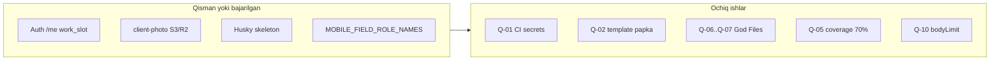
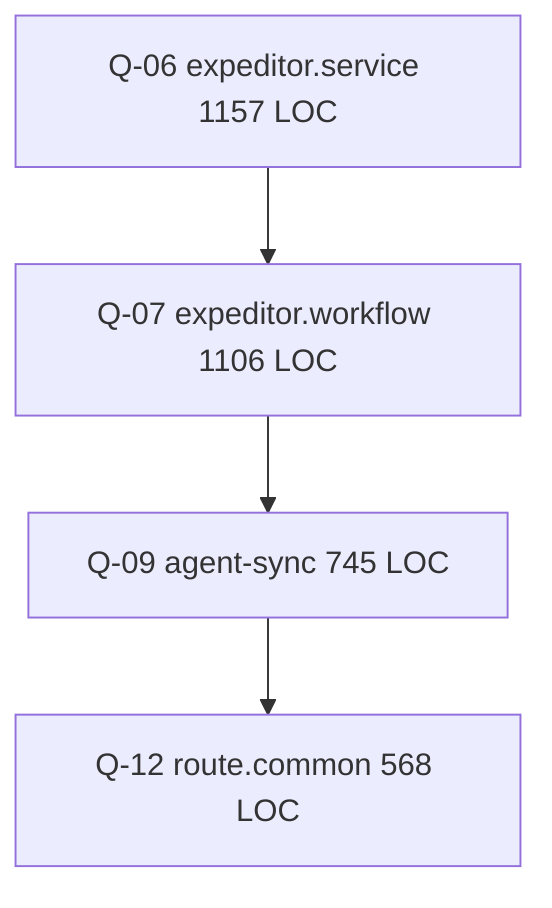

# SALEC — Qolgan 21 vazifa bajarish rejasi

## Hozirgi holat (tekshiruv natijasi)

Asosiy audit rejasi ([`.cursor/plans/salec_arena_audit_tekshiruv_va_to_liq_reja.md`](d:\SALEC — копия\.cursor\plans\salec_arena_audit_tekshiruv_va_to_liq_reja.md)) **62/62** deb belgilangan, lekin [`QOLGAN-VAZIFALAR-ROYHATI.md`](c:\Users\UNKNOWN_007\Downloads\QOLGAN-VAZIFALAR-ROYHATI.md) dagi aniq tekshiruvlar hali to‘liq yopilmagan.



| ID | Vazifa | Holat | Izoh |
|----|--------|-------|------|
| Q-01 | CI JWT → GitHub Secrets | **Ochiq** | [`.github/workflows/ci.yml`](d:\SALEC — копия\.github\workflows\ci.yml) 57–58: hardcoded secretlar |
| Q-02 | `_template-kpi-planning/` olib tashlash | **Ochiq** | 47 fayl repoda, `.gitignore`da yo‘q |
| Q-03 | Husky pre-commit | **Qisman** | [`backend/.husky/pre-commit`](d:\SALEC — копия\backend\.husky\pre-commit) bor, lekin `husky.sh` (`_/` papka) yo‘q — hook ishlamasligi mumkin |
| Q-04 | `MOBILE_FIELD_ROLE_NAMES` markazlash | **Qisman** | [`app-access.service.ts`](d:\SALEC — копия\backend\src\modules\auth\app-access.service.ts) da bor; inline qolgan: [`mobile-agent-sync.service.ts:694`](d:\SALEC — копия\backend\src\modules\mobile\mobile-agent-sync.service.ts), [`field.route.ts:17`](d:\SALEC — копия\backend\src\modules\field\field.route.ts) |
| Q-05 | Coverage 30% → 70% | **Ochiq** | [`vitest.config.ts`](d:\SALEC — копия\backend\vitest.config.ts): `lines: 30` |
| Q-06 | `mobile.expeditor.service.ts` bo‘lish | **Ochiq** | **1157** qator |
| Q-07 | `mobile.expeditor.workflow.service.ts` bo‘lish | **Ochiq** | **1106** qator |
| Q-08 | Auth `/me` — work_slot ajratish | **Bajarilgan** | [`auth.route.ts`](d:\SALEC — копия\backend\src\modules\auth\auth.route.ts) → `getActiveSlotForUser` [`work-slots.query.read.ts`](d:\SALEC — копия\backend\src\modules\work-slots\work-slots.query.read.ts) dan import |
| Q-09 | `mobile-agent-sync.service.ts` bo‘lish | **Ochiq** | **745** qator |
| Q-10 | Global `bodyLimit` → 5MB | **Ochiq** | [`app.ts:32`](d:\SALEC — копия\backend\src\app.ts): `CLIENT_PHOTO_HTTP_BODY_LIMIT_BYTES` (~33MB) global |
| Q-11 | Legacy RBAC migratsiya + ADR | **Qisman** | `rbac:migrate-legacy` script bor; [`ADR-004`](d:\SALEC — копия\docs\adr) yo‘q, legacy fayllar saqlanmoqda |
| Q-12 | `mobile.route.common.ts` bo‘lish | **Ochiq** | **568** qator |
| Q-13 | CORS strict validation | **Qisman** | Wildcard olib tashlangan; `!origin` hali `true`, production localhost blok yo‘q |
| Q-14 | Railway Redis AOF tekshiruv | **Qisman** | Docker AOF ✅; [`BACKUP_AND_DR.md`](d:\SALEC — копия\docs\BACKUP_AND_DR.md) da Railway qadamlari yetarli emas |
| Q-15 | `plans.setup.service.ts` bo‘lish | **Ochiq** | **691** qator |
| Q-16 | `tenant-settings.route.ts` bo‘lish | **Ochiq** | **498** qator |
| Q-17 | Domain events kengaytirish | **Qisman** | Faqat [`order.events.ts`](d:\SALEC — копия\backend\src\domain\events\order.events.ts) |
| Q-18 | client-photo S3/R2 | **Asosan bajarilgan** | [`client-photo-storage.ts`](d:\SALEC — копия\backend\src\lib\client-photo-storage.ts) `storagePut` ishlatadi; signed URL ixtiyoriy yaxshilash |
| Q-19 | `initial-setup-export.service.ts` bo‘lish | **Ochiq** | **513** qator |
| Q-20 | Railway `restartPolicyMaxRetries` | **Ochiq** | [`railway.toml`](d:\SALEC — копия\backend\railway.toml): faqat `ON_FAILURE` |
| Q-21 | Cost monitoring alert | **Qisman** | [`COST_MANAGEMENT.md`](d:\SALEC — копия\docs\COST_MANAGEMENT.md) umumiy; konkret billing alert yo‘q |

**Haqiqiy qolgan ish:** ~17 vazifa + 4 ta tekshiruv/yakunlash.

---

## Faza 1 — Bugun (~1 soat): xavfsizlik va repo tozalash

### Q-01: CI JWT secrets
- [`.github/workflows/ci.yml`](d:\SALEC — копия\.github\workflows\ci.yml) da:
  ```yaml
  JWT_ACCESS_SECRET: ${{ secrets.CI_JWT_ACCESS_SECRET }}
  JWT_REFRESH_SECRET: ${{ secrets.CI_JWT_REFRESH_SECRET }}
  ```
- **GitHub (NEW_PRO repo):** Settings → Secrets → Actions:
  - `CI_JWT_ACCESS_SECRET` = `test-access-secret-min-32-chars-for-ci-only`
  - `CI_JWT_REFRESH_SECRET` = `test-refresh-secret-min-32-chars-for-ci-only`
- CI run tekshirish (`gh workflow run` yoki push trigger).

### Q-02: Template papkani olib tashlash
- `git rm -r _template-kpi-planning/`
- [`.gitignore`](d:\SALEC — копия\.gitignore) ga `_template-kpi-planning/` qo‘shish
- Commit + `new_pro` ga push

### Q-03: Husky to‘liq yoqish
- `backend/` ichida: `npx husky init` (`.husky/_/husky.sh` yaratadi)
- Mavjud [`pre-commit`](d:\SALEC — копия\backend\.husky\pre-commit) va [`pre-commit-check.sh`](d:\SALEC — копия\backend\scripts\pre-commit-check.sh) ni saqlash
- Git `core.hooksPath` = `backend/.husky` ekanligini [`docs/DEVELOPER_SETUP.md`](d:\SALEC — копия\docs\DEVELOPER_SETUP.md) da tasdiqlash
- Test: noxato commit → hook to‘xtatishi kerak

---

## Faza 2 — Bu hafta: kod sifati va xavfsizlik (Q-04, Q-08, Q-10)

### Q-04: Mobile rollar markazlash
- `MOBILE_FIELD_ROLE_NAMES` ni [`backend/src/lib/constants.ts`](d:\SALEC — копия\backend\src\lib\constants.ts) ga ko‘chirish (yoki `app-access.service.ts` dan re-export — mavjud importlarni buzmaslik)
- Inline almashtirish:
  - `mobile-agent-sync.service.ts:694` → `MOBILE_FIELD_ROLES.has(u.role)`
  - `field.route.ts:17` → `MOBILE_FIELD_ROLE_NAMES` + admin rollar

### Q-08: Tekshiruv (skip implement)
- Allaqachon to‘g‘ri ajratilgan — rejada faqat smoke test: `GET /api/:slug/auth/me` integration test

### Q-10: bodyLimit qisqartirish
- [`app.ts`](d:\SALEC — копия\backend\src\app.ts): global `bodyLimit: 5 * 1024 * 1024`
- Foto upload route(lar)ida route-level yoki plugin-level katta limit saqlash
- `@fastify/multipart` limits allaqachon alohida — regression test: client photo + Excel + APK upload

---

## Faza 3 — Bu hafta: God Files bo‘linishi (eng katta texnik qarz)

Ketma-ketlik (import zanjirini buzmaslik uchun):



Har bir bo‘linishda bir xil pattern (audit rejadagi S1-03 kabi):
1. Yangi modullar yaratish (feature bo‘yicha)
2. Barrel `*.service.ts` re-export
3. [`mobile.route.expeditor.ts`](d:\SALEC — копия\backend\src\modules\mobile\mobile.route.expeditor.ts) import yangilash
4. `npm run build` + `npm run refaktoring:verify` + tegishli integration testlar

**Q-06** → `mobile.expeditor.orders|payments|returns.service.ts`  
**Q-07** → `mobile.expeditor.workflow.accept|deliver|reload.ts`  
**Q-09** → `mobile-agent-sync.full|delta|config.service.ts`  
**Q-12** → shared prehandlerlar `mobile.route.shared.ts` ga (≤100 LOC maqsad)

---

## Faza 4 — Coverage va RBAC (2–5 kun)

### Q-05: Coverage 70%
- Bosqichma-bosqich: avval `include` ro‘yxatini kengaytirish, keyin threshold oshirish
- Prioritet modullar (hujjatdagi kabi):
  - `orders/domain/order.lifecycle.ts`
  - `payments/payment.balance.ts`
  - `mobile/mobile-order-bonus-preview.service.ts`
- Oxirida [`vitest.config.ts`](d:\SALEC — копия\backend\vitest.config.ts) thresholds: lines/functions/statements **70**, branches **60**

### Q-11: Legacy permissions
- `legacy-key-map.ts` audit — barcha keylar yangi CRUD ga map
- `npm run rbac:migrate-legacy` test tenantlarda
- Yangi [`docs/adr/ADR-004-rbac-migration-plan.md`](d:\SALEC — копия\docs\adr\ADR-004-rbac-migration-plan.md): qachon legacy fayllarni o‘chirish mumkin

---

## Faza 5 — Keyingi sprint: infra, domain, kichik God Files

| ID | Asosiy fayllar | Natija |
|----|----------------|--------|
| Q-13 | [`cors-options.ts`](d:\SALEC — копия\backend\src\lib\cors-options.ts), [`env.ts`](d:\SALEC — копия\backend\src\config\env.ts) | Production: `!origin → false`, localhost blok, `cors_rejected` log |
| Q-14 | [`BACKUP_AND_DR.md`](d:\SALEC — копия\docs\BACKUP_AND_DR.md) | Railway Redis AOF checklist; Upstash ADR ixtiyoriy |
| Q-15 | `plans.setup.service.ts` | create + import modullar |
| Q-16 | `tenant-settings.route.ts` | general + bonus route fayllari |
| Q-17 | `domain/events/` | `payment.events.ts`, `client.events.ts`, `stock.events.ts` |
| Q-18 | Tekshiruv | Signed URL kerak bo‘lsa `storage.service.ts` ga qo‘shish |
| Q-19 | `initial-setup-export.service.ts` | clients + products + orchestrator |
| Q-20 | [`railway.toml`](d:\SALEC — копия\backend\railway.toml) | `restartPolicyMaxRetries = 5` |
| Q-21 | [`COST_MANAGEMENT.md`](d:\SALEC — копия\docs\COST_MANAGEMENT.md) | $50/$100 billing alert + oylik checklist |

---

## Tekshiruv va baho maqsadi

| Bosqich | Vazifalar | Kutilgan baho |
|---------|-----------|---------------|
| Faza 1 | Q-01, Q-02, Q-03 | 79 → ~82 |
| Faza 2–3 | Q-04..Q-12 (Q-08 skip) | ~85 |
| Faza 4–5 | Q-05, Q-11, Q-13..Q-21 | **90+** |

Har faza oxirida:
- `npm run build`
- `npm run foundation:verify:fast` (yoki to‘liq `prod:verify` Docker bilan)
- `npm run audit:max-loc` — God File allowlist qisqarishi
- NEW_PRO ga commit + push

---

## Muhim eslatmalar

1. **Q-08 va Q-18** — implementatsiya deyarli tayyor; vaqt tejash uchun “verify-only”.
2. **bodyLimit (Q-10)** — hujjatda 120MB deb yozilgan, kodda ~33MB; maqsad baribir **5MB global** + route-specific.
3. **GitHub Secrets (Q-01)** — kod o‘zgarishi yetarli emas; siz GitHub UI da secret qo‘yishingiz shart.
4. **APK fayllar (~61MB)** — alohida: `.gitignore` yoki Git LFS (oldingi push ogohlantirishi).
