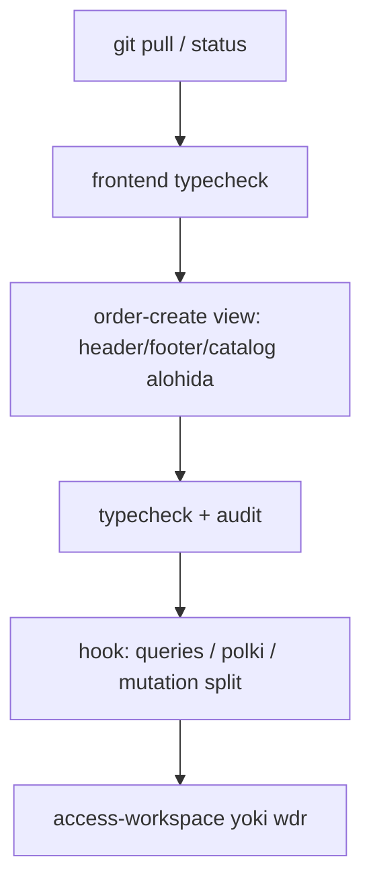

# SALEC refaktoring — handoff (2026-05-17)

> **✅ YAKUNLANDI (2026-06-26)** — Sprint B asosiy (order-create arxitektura, auth/routes, audit gate): [docs/FRONTEND_REFACTORING_YAKUNLANDI.md](../../docs/FRONTEND_REFACTORING_YAKUNLANDI.md)  
> Tekshiruv: `cd frontend && npm run refaktoring:verify`

**Maqsad:** Boshqa kompyuterdan ishni **shu joydan** davom ettirish.  
**Asosiy reja (o‘zgartirmang):** [refaktoring_solishtirish_1e3d116d.plan.md](./refaktoring_solishtirish_1e3d116d.plan.md)  
**Oldingi backend reja:** [salec_refaktoring_reja_v1.plan.md](./salec_refaktoring_reja_v1.plan.md)

> **Muhim:** `refaktoring_solishtirish` ichidagi barcha todo lar `completed` deb belgilangan, lekin **frontend katta fayllar hali to‘liq bo‘linmagan**. Quyida **haqiqiy** holat ko‘rsatilgan.

---

## 1. Qisqa holat (bugun)

| Sprint | Reja bo‘yicha | Haqiqiy holat |
|--------|---------------|---------------|
| **A** FAZA 0 | Arxiv, `.env.example`, JWT | **Asosan bajarilgan** |
| **B** FAZA 2 frontend | 4 ta katta workspace + audit | **Qisman** — order-create arxitektura tayyor, lekin hook/view hali ~2100 qator |
| **C** Backend qolgan | J.13 modullar | **v1 bo‘yicha allaqachon** — yangi split shart emas |
| **D** Perf / Redis / BullMQ | Index, redis, cursor, jobs | **Inkrement qo‘shilgan** — to‘liq emas |
| **E** Test / coverage | 60%+ orders, e2e | **Qisman** — e2e smoke kengaydi, coverage threshold **0%** |

**Tekshiruv (loyiha ildizida):**

```powershell
cd D:\SALEC\backend
npm run audit:max-loc
npm run typecheck

cd D:\SALEC\frontend
npm run typecheck
npm run audit:max-loc
```

Oxirgi sessiyada: backend va frontend `typecheck` yashil; frontend `audit:max-loc` `components/orders/order-create` uchun yashil (composition root lar skip qilingan).

---

## 2. Nima qilingan (batafsil)

### Sprint A — FAZA 0 (xavfsizlik va repo)

| Band | Holat | Qayer |
|------|--------|--------|
| `*.backup.ts` arxivdan chiqarish | **Bajarilgan** (sessiya bo‘yicha) | `archive/` (rollback nusxalar); `backend/src` da backup qolmagan |
| `backend/.env.example` | **Bajarilgan** | [`backend/.env.example`](../../backend/.env.example) |
| JWT/DB production guard | **Mavjud** | [`backend/src/config/env.ts`](../../backend/src/config/env.ts) — prod da default secret/DB uchun `throw` |
| `.gitignore` `.env.example` | **Tekshirish kerak** | commit qilinmagan bo‘lishi mumkin |

### Sprint B — FAZA 2 (frontend)

#### Order create (prioritet #1) — **eng ko‘p ish shu yerda**

**Oldin:** bitta fayl `order-create-workspace.tsx` ~4751 qator (git HEAD).  
**Dedupe** (takroriy utils/types olib tashlangan): ~3860 qator.  
**Hozirgi tuzilma:**

```
frontend/components/orders/
  order-create-workspace.tsx          # barrel (2 qator) → order-create/
  order-create/
    order-create-workspace.tsx        # ~23 qator — shell (tenant + hook/view)
    types.ts, constants.ts, utils.ts
    category-issue-badge.tsx
    polki-return-lines-table.tsx
    polki-client-search-select.tsx
    hooks/
      use-order-create.ts             # ~2161 qator — mantiq, query, mutation
    view/
      order-create-view.tsx           # ~2100 qator — JSX/UI
```

**Ishlaydi:**

- `useOrderCreate(props)` → `OrderCreateVm` (193 ta maydon, avtomatik sinxron)
- Tenant yo‘q bo‘lsa — shell ichida login havolasi
- `npm run typecheck` (frontend) yashil

**Skriptlar (qayta tiklash / qayta bo‘lish):**

| Skript | Vazifa |
|--------|--------|
| [`frontend/scripts/restore-and-split-order-create.mjs`](../../frontend/scripts/restore-and-split-order-create.mjs) | `git show HEAD:...order-create-workspace.tsx` → dedupe → `order-create/order-create-workspace.tsx` |
| [`frontend/scripts/build-order-create-split-v2.mjs`](../../frontend/scripts/build-order-create-split-v2.mjs) | Monolitdan `hook` + `view` + yupqa shell |
| [`frontend/scripts/fix-order-create-vm.mjs`](../../frontend/scripts/fix-order-create-vm.mjs) | Hook `return { ... }` va view destructuring ni sinxronlash |
| [`frontend/scripts/dedupe-order-create-workspace.mjs`](../../frontend/scripts/dedupe-order-create-workspace.mjs) | Takroriy import/bo‘laklarni olib tashlash |

**Qayta tiklash tartibi (buzilsa):**

```powershell
cd D:\SALEC\frontend
node scripts/restore-and-split-order-create.mjs
node scripts/build-order-create-split-v2.mjs
node scripts/fix-order-create-vm.mjs
# view oxirida ortiqcha `}` bo‘lsa — olib tashlang
# view ga kerak: POLKI_PRICE_TYPE_LABEL_RU, parseStockQty importlari (constants/utils)
npm run typecheck
```

**Frontend audit CI:**

- [`frontend/scripts/audit-max-file-lines.mjs`](../../frontend/scripts/audit-max-file-lines.mjs) — default root: `components/orders/order-create`
- Skip (vaqtincha): `hooks/use-order-create.ts`, `view/order-create-view.tsx`, `order-create-workspace.tsx`
- [`.github/workflows/ci.yml`](../../.github/workflows/ci.yml) — frontend job da `npm run audit:max-loc`

**Ishlamagan / bekor qilingan urinishlar:**

- `split-order-create-view.mjs` — JSX ternary o‘rtasidan kesilgani uchun **ishlatmang** (sintaksis buziladi)
- `extract-order-create-view-parts.mjs` — xuddi shu sabab; faqat to‘liq bloklar (header/footer) bilan qayta yozish kerak
- `access-main/` papkasi — yarim split TS xatolari; **o‘chirilgan**. Asosiy [`access-workspace.tsx`](../../frontend/components/access/access-workspace.tsx) **2870 qator** — tegilmagan

#### Boshqa frontend (reja ro‘yxati)

| Fayl | Qatorlar (~) | Holat |
|------|--------------|--------|
| `access-workspace.tsx` | 2870 | **Bo‘linmagan** |
| `wdr-report-builder.tsx` | 2698 | **Faqat** `use-report-builder-pivot-height` ajratilgan |
| `dashboard-sales-monitoring.tsx` | ~2643 | **Bo‘linmagan** |
| `access-user-detail-panel.tsx` | ~2522 | **Bo‘linmagan** |
| `agents-workspace.tsx` | ~2453 | **Bo‘linmagan** |
| `app/.../orders/page.tsx` | ~2067 | **Bo‘linmagan** |

**WDR qismi:**

```
frontend/components/reports/
  wdr-report-builder.tsx
  wdr/use-report-builder-pivot-height.ts   # yangi (~22 qator mantiq)
```

Skript: [`frontend/scripts/split-wdr-report-builder.mjs`](../../frontend/scripts/split-wdr-report-builder.mjs) (takror ishlatilsa, allaqachon bo‘linganini tekshiradi).

#### Auth / routes (reja 2.2–2.3)

| Band | Holat |
|------|--------|
| [`frontend/lib/auth-sync.ts`](../../frontend/lib/auth-sync.ts) | Qo‘shilgan / yangilangan |
| [`frontend/lib/routes.ts`](../../frontend/lib/routes.ts) | PROTECTED_ROUTES markazlashtirish |
| [`frontend/middleware.ts`](../../frontend/middleware.ts) | routes bilan bog‘langan |
| [`frontend/lib/auth-store.ts`](../../frontend/lib/auth-store.ts) | auth-sync dan foydalanadi |

### Sprint C — Backend qolgan (v1 J.13)

Reja bandi «reports, warehouse-transfers, client-dedupe, sales-directions» — **v1/v3 refaktorida allaqachon barrel + modullar**. Yangi katta split **talab qilinmaydi**, agar `npm run audit:max-loc` (backend) yashil bo‘lsa.

### Sprint D — Performance / infra

| Band | Holat | Fayl / izoh |
|------|--------|-------------|
| Cursor pagination | **Orders list** da qo‘shilgan | [`backend/src/lib/pagination.ts`](../../backend/src/lib/pagination.ts), [`order.query.ts`](../../backend/src/modules/orders/domain/order.query.ts) — `cursor`, `next_cursor`, `has_next` |
| Redis tenant settings | **Qo‘shilgan** | [`tenant-settings.profile.read.ts`](../../backend/src/modules/tenant-settings/tenant-settings.profile.read.ts), `tenant:{id}:settings`, TTL ~1 soat |
| Slow query log | **Opt-in** | [`database.ts`](../../backend/src/config/database.ts) — `PRISMA_QUERY_LOG=1` |
| BullMQ job nomlari | **Stub** | [`process-background-job.ts`](../../backend/src/jobs/process-background-job.ts) — `export_excel`, `generate_pdf`, `cleanup_old_logs` (handler stub) |
| `INSUFFICIENT_STOCK` | **AppError kod** | [`app-error.ts`](../../backend/src/lib/app-error.ts) |
| Indexlar EXPLAIN asosida | **Qisman / reja** | Ko‘p index allaqachon schema da; qo‘shimcha faqat `perf:explain` dan keyin |

**Qolmagan:** Redis to‘liq TTL jadvali (narxlar/stock), PDF/Excel haqiqiy implementatsiya, cursor boshqa 2–3 list API.

### Sprint E — Test va CI

| Band | Holat |
|------|--------|
| E2E smoke | `order-create-full-stack.spec.ts` [`frontend/package.json`](../../frontend/package.json) `test:e2e:smoke` ga qo‘shilgan |
| Orders domain coverage test | [`backend/tests/orders-domain-coverage.smoke.test.ts`](../../backend/tests/orders-domain-coverage.smoke.test.ts) |
| Vitest threshold 60% | **Bajarilmagan** — [`vitest.config.ts`](../../backend/vitest.config.ts) hali **0%** (haqiqiy domain testlar yetarli emas) |

---

## 3. Nima qolgan (prioritet bo‘yicha)

### Darhol (ertaga 1-sessiya)

1. **Order create view bo‘linishi** (~2100 → bir nechta ≤400 qator fayl)
   - Xavfsiz bo‘laklar: `OrderCreateViewHeader`, `OrderCreateFlowNotes`, `OrderCreateViewFooter`, `OrderCreateCatalogTable`, `OrderCreateStandardParams`, `OrderCreatePolkiParams`
   - **Qoida:** faqat to‘liq JSX bloklari; ternary o‘rtasidan kesmang
   - Keyin audit skip ro‘yxatidan `view/order-create-view.tsx` ni olib tashlang

2. **Order create hook bo‘linishi** (~2161 qator)
   - Masalan: `use-order-create-queries.ts`, `use-order-create-polki.ts`, `use-order-create-mutation.ts`, barrel `use-order-create.ts`

3. **Tekshiruv**

   ```powershell
   cd D:\SALEC\frontend
   npm run typecheck
   npm run audit:max-loc
   npm run test:e2e:smoke   # ixtiyoriy, backend+web ishlasa
   ```

### Sprint B davomi (2–4 hafta)

| # | Vazifa | Taxminiy LOC |
|---|--------|--------------|
| 1 | `access-workspace.tsx` — incremental extract ( **`access-main/` qayta barrel qilmasdan** ) | 2870 |
| 2 | `wdr-report-builder` — `support.ts` + `toolbar.ts` + asosiy komponent | 2698 |
| 3 | `dashboard-sales-monitoring.tsx` | ~2643 |
| 4 | `access-user-detail-panel`, `agents-workspace`, `orders/page` | 2000+ |
| 5 | Frontend audit scope kengaytirish: `components/**` bosqichma | 107 fayl >400 |

### Sprint D davomi

- [ ] Cursor pagination: clients, payments (yoki eng yukli 2 list)
- [ ] BullMQ: `export_excel` / `generate_pdf` ni haqiqiy handler ga ulash
- [ ] Redis: stock/prices TTL (reja jadvali)
- [ ] `perf:explain` → faqat yetishmayotgan indexlar

### Sprint E davomi

- [ ] `orders/domain` uchun **haqiqiy** unit/integration testlar, keyin threshold 60%
- [ ] E2E: access, dashboard monitoring kritik yo‘llar

### **Qilmaslik** (reja bilan kelishilgan)

- Global `deleted_at` Order/Client/Product ga
- BigInt pul migratsiyasi (ADR kerak)
- Bonus 14→4 faylga qisqartirish (ixtiyoriy)
- WebSocket qo‘shish (SSE yetarli)

---

## 4. Muhim yo‘llar va buyruqlar

### Loyiha tuzilmasi

```
D:\SALEC\
  backend\src\          # audit:max-loc ≤400 (backup skip)
  frontend\components\
  archive\              # backup.ts rollback (agar commit qilingan bo‘lsa)
  .cursor\plans\         # rejalar (shu fayl ham shu yerda)
```

### Git holati (ertaga)

Ko‘p o‘zgarishlar **commit qilinmagan** bo‘lishi mumkin (`git status` da `order-create/`, skriptlar, CI, backend pagination va h.k.). Boshqa PC da:

```powershell
cd D:\SALEC
git status
git pull   # agar remote ga push qilgan bo‘lsangiz
# yoki patch/branch orqali o‘tkazish
```

**Tavsiya:** davom etishdan oldin bir marta commit yoki stash:

```powershell
git add frontend/components/orders/order-create backend/src/lib/pagination.ts ...
git commit -m "refactor(order-create): hook + view split, audit scripts"
```

### Windows PowerShell

`&&` o‘rniga `;` ishlating:

```powershell
cd D:\SALEC\frontend; npm run typecheck
```

### CI (GitHub)

[`.github/workflows/ci.yml`](../../.github/workflows/ci.yml):

- Backend: `audit:max-loc`, test, coverage:orders, build, …
- Frontend: build, `test:all` (jumladan `audit:max-loc` order-create papkasi)

---

## 5. Ertaga — tavsiya etilgan ketma-ketlik



1. `npm run typecheck` (frontend + backend) — yashil ekanini tasdiqlang  
2. `order-create-view.tsx` dan **bitta** kichik komponent ajrating (masalan footer ~30 qator), typecheck  
3. Catalog table (~350+ qator) — alohida fayl  
4. Hook bo‘linishi  
5. Keyin `access` yoki `wdr`  

---

## 6. Xatolar va saboqlar (takrorlamang)

| Muammo | Sabab | Yechim |
|--------|--------|--------|
| `access-main/` TS xatolari | Barrel + noto‘g‘ri prop tiplar | Papkani o‘chirish; faqat `access-workspace.tsx` dan incremental extract |
| View split sintaksis xatosi | `return (` dan keyin to‘g‘ridan-to‘g‘ri `{localError ?` | `return (<> ... </>)` yoki butun `PageShell` blokini ko‘chiring |
| `build-order-create-split-v2` «markers not found» | Monolit emas, yupqa shell | Avval `restore-and-split-order-create.mjs` |
| `fix-order-create-vm` 297 ta key | Ichki `const` lar ham qo‘shilgan | Skript faqat `^  const` (2 space) — hozirgi versiya to‘g‘ri |
| Monolit `order-create-workspace.tsx` 3860 qator | Dedupe nusxasi barrel o‘rniga yozilgan | Barrel: faqat `export { ... } from "./order-create/..."` |
| Coverage 60% fail | Domain uchun test yo‘q | Threshold 0% qoldirildi; avval testlar |

---

## 7. Bog‘liq hujjatlar

| Hujjat | Ma’nosi |
|--------|---------|
| [refaktoring_solishtirish_1e3d116d.plan.md](./refaktoring_solishtirish_1e3d116d.plan.md) | Tashqi 6 fazali reja vs loyiha solishtiruvi (todo lar optimistik) |
| [salec_refaktoring_reja_v1.plan.md](./salec_refaktoring_reja_v1.plan.md) | Backend servis split (asosan bajarilgan) |
| Agent chat (sessiya) | [transcript](C:\Users\botir\.cursor\projects\d-SALEC\agent-transcripts) — `9c014f80-d223-4b58-bebb-0e8962f3e158` |

---

## 8. Tezkor checklist (ertaga birinchi 15 daqiqa)

- [x] `npm run refaktoring:verify` (2026-06-26)
- [ ] Keyingi inkrement (ixtiyoriy): access/wdr/dashboard katta workspace split

---

*Oxirgi yangilanish: 2026-06-26 (verify gate + yakun hujjat).*
