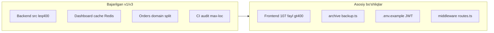

# SALEC — tashqi reja vs loyiha: tekshiruv va yangilangan yo‘l xaritasi

## Qisqa xulosa

| Qatlam | Hujjatdagi taxmin | Haqiqat (2026-05) |
|--------|-------------------|-------------------|
| Backend `src/` ≤400 qator | Hali katta servislar | **Bajarilgan** — `npm run audit:max-loc` yashil; barrel + `*.backup.ts` |
| 61 ta `*.backup.ts` | `src/` da tozalash kerak | **To‘g‘ri** — 61 fayl, rollback uchun saqlangan |
| Frontend katta fayllar | 4 ta prioritet | **To‘g‘ri va muhim** — 107 ta fayl >400 qator |
| Bonus 14→4 fayl | `orders/domain/bonus/` | **Qisman** — 14 ta fayl bo‘lingan, lekin `bonus/` papkasi yo‘q; barrel mavjud |
| Soft delete jadvali | Order/Client/Product/… | **Ko‘p qism noto‘g‘ri** — schema boshqacha |
| WebSocket | «Hozir yo‘q» | **Noto‘g‘ri** — **SSE** order stream mavjud |
| BullMQ / Redis | «Qo‘shish kerak» | **Qisman** — import + dashboard cache ishlaydi |
| DB indexlar 3.2 | Qo‘shish kerak | **Ko‘p index allaqachon bor** |
| Client balance MV | Har so‘rovda SUM | **Noto‘g‘ri** — `client_balances` jadvali + movement |

---

## Faza bo‘yicha tekshiruv

### FAZA 0 — Tozalash va xavfsizlik

| Band | Hujjat | Loyiha | Verdikt |
|------|--------|--------|---------|
| **0.1** 61 `*.backup.ts` → `archive/` | 2 MB tozalash | 61 fayl [`backend/src`](backend/src) ichida; audit ularni **skip** qiladi | **To‘g‘ri** — arxivlash + `.gitignore` + `tsconfig` exclude mantiqiy; v1 rollback siyosatini yangilash kerak |
| **0.2** JWT `.default()` olib tashlash | [`env.ts:23-24`](backend/src/config/env.ts) | Defaultlar bor; **production** da default secret/DB/Redis uchun `throw` (54–76-qatorlar) | **Qisman to‘g‘ri** — dev/test hali default ishlatadi; CI ham test secret ishlatadi ([`ci.yml:41-42`](.github/workflows/ci.yml)) |
| **0.3** `.env.example` | `backend/.env.example` | **Fayl yo‘q**; faqat `.env` (gitignore) | **To‘g‘ri** — yaratish kerak |

**Eslatma:** `DATABASE_URL` default ham xavfsizlik riski (`postgres:0223@...`) — hujjatda faqat JWT emas, buni ham `.env.example` da ko‘rsatish kerak.

---

### FAZA 1 — Backend arxitektura

| Band | Hujjat | Loyiha | Verdikt |
|------|--------|--------|---------|
| **1.1** Prisma «connection pool» + slow query | `database.ts` o‘zgartirish | [`database.ts`](backend/src/config/database.ts): oddiy `PrismaClient({ log: ["error","warn"] })`; pool — odatda `DATABASE_URL` query params (`connection_limit`, PgBouncer) | **Noto‘g‘i nom** — kod namunasi pool emas, **query event logging**; alohida sprint sifatida qo‘shish mumkin |
| **1.2** BigInt (tiyin) vs Decimal | 25+ Decimal maydon | Butun schema **`Decimal(15,2)`**; `AppError` ham pulni string/Decimal bilan ishlaydi | **To‘g‘ri muammo**, lekin **katta migratsiya** (oylar); Variant C uzoq muddat; qisqa muddat: Decimal + aniq rounding qoidalari |
| **1.3** Soft delete jadvali | Order, Client, Product, Warehouse, BonusRule | **Haqiqat:** `deleted_at` — `ClientPayment`, `GoodsReceipt`, `Expense`, `Territory`, `ClientOpeningBalanceEntry` va b. **Order, Client, Product, Warehouse, BonusRule — yo‘q**; Client → `merged_into_client_id`; Product/Warehouse → `is_active` | **Noto‘g‘ri jadval** — yangi `deleted_at` qo‘shish alohida **biznes qaror** (Order uchun status arxivi allaqachon bor) |
| **1.4** Bonus 14→4 fayl | `orders/domain/bonus/*` | [`order-bonus-apply.ts`](backend/src/modules/orders/order-bonus-apply.ts) barrel; 14 ta modul allaqachon ≤400 bo‘lingan ([v1 reja B](.cursor/plans/salec_refaktoring_reja_v1.plan.md)) | **Eskirgan taklif** — qayta 4 faylga **qisqartirish** ixtiyoriy (nomlash), majburiy emas |
| **1.5** `AppError` + `api-error.ts` | Yangi klass `statusCode` bilan | [`app-error.ts`](backend/src/lib/app-error.ts) — `AppError` **mavjud** (code + meta, statusCode yo‘q); [`api-error.ts`](backend/src/lib/api-error.ts) — HTTP `sendApiError` | **Qisman** — kengaytirish kerak bo‘lsa, mavjud `AppError` ni buzmasdan `INSUFFICIENT_STOCK` kabi kodlar qo‘shish |

**Muhim:** FAZA 1 ning katta qismi (orders/dashboard/payments/staff split) **v1/v3 da bajarilgan**. Yangi backend sprint — **qolgan kandidatlar** (v1 J.13): `sales-directions`, `client-dedupe`, `warehouse-transfers`, `reports/*.service.ts` (450–935 qator).

---

### FAZA 2 — Frontend

| Band | Hujjat LOC | Haqiqiy LOC | Verdikt |
|------|------------|-------------|---------|
| `order-create-workspace.tsx` | 4584 | **4751** | **To‘g‘ri prioritet #1** |
| `access-workspace.tsx` | 2741 | **2871** | To‘g‘ri |
| `wdr-report-builder.tsx` | 2594 | **2716** | To‘g‘ri |
| `dashboard-sales-monitoring.tsx` | 2521 | **2643** | To‘g‘ri |
| 100+ fayl >400 | Maqsad 0 | **107 ta** `frontend/components` + `app` | **To‘g‘ri ko‘rsatkich** |

**2.2 Auth:** [`auth-store.ts`](frontend/lib/auth-store.ts) allaqachon `sd_auth` cookie + `savdo-auth` localStorage; alohida `lib/auth-sync.ts` — **yaxshilash**, lekin «ikki nusxa muammo» qisman hal qilingan.

**2.3 `PROTECTED_ROUTES`:** [`middleware.ts`](frontend/middleware.ts) da ro‘yxat **inline** (34–51); `routes.ts` konstanta — **to‘g‘ri**, lekin refaktor (xulosa o‘zgarmaydi).

**Tegmaslik zonasi** (mavjud v1): `work-slots`, `access`, `report-builder` — servis mantiqiga tegmasdan UI bo‘lish mumkin.

---

### FAZA 3 — Database

| Band | Verdikt |
|------|---------|
| **3.1** N+1 → `select` | Umumiy **to‘g‘ri amaliyot**; loyiha allaqachon ko‘p joyda `select` ishlatadi; modul-modul audit kerak |
| **3.2** Composite indexlar | **Ko‘p index mavjud:** masalan `Order`: `@@index([tenant_id, status, created_at(sort: Desc)])`, `@@index([tenant_id, order_type, agent_id, created_at(sort: Desc)])` ([`schema.prisma:1207-1218`](backend/prisma/schema.prisma)); `Stock`: `@@unique([tenant_id, warehouse_id, product_id])`; payment: `deleted_at` + `paid_at` indexlar + migratsiya `20260501120000`, `20260508121500` | **Takroriy** — avval `EXPLAIN` / `perf:explain`, keyin faqat yetishmayotgan index |
| **3.3** Materialized view / Redis balance | **`ClientBalance` + `ClientBalanceMovement`** allaqachon bor ([`schema.prisma:794-821`](backend/prisma/schema.prisma)); ledger servislar alohida | **Arxitektura noto‘g‘i tasvirlangan** — MV faqat agar report/query sekin bo‘lsa |
| **3.4** Cursor pagination | `lib/pagination.ts` yo‘q | **To‘g‘ri** — yangi; list endpointlarda bosqichma |

---

### FAZA 4 — Infrastructure

| Band | Hujjat | Loyiha | Verdikt |
|------|--------|--------|---------|
| **4.1** Redis TTL jadvali | 5 turli key | [`redis-cache.ts`](backend/src/lib/redis-cache.ts) + [`dashboard.cache.ts`](backend/src/modules/dashboard/dashboard.cache.ts) (`tenant:{id}:dashboard`); narxlar/stock qisman | **Qisman bajarilgan** — hujjatdagi to‘liq key sxemasi hali emas |
| **4.2** BullMQ pdf/excel/import/cleanup | 4 navbat | [`background-queue.ts`](backend/src/jobs/background-queue.ts) — **bitta** `background-default`; import + `order_status_notify` ([`process-background-job.ts`](backend/src/jobs/process-background-job.ts)) | **Qisman** — import bor; PDF/Excel alohida queue nomlari yo‘q |
| **4.3** WebSocket | Yo‘q | [`order-stream.route.ts`](backend/src/modules/orders/order-stream.route.ts) — **SSE** + Redis pub/sub | **Noto‘g‘ri** — real-time bor; WebSocket kerak bo‘lsa alohida talab |

---

### FAZA 5 — Test va CI

| Band | Hujjat | Loyiha | Verdikt |
|------|--------|--------|---------|
| Coverage 70% | Unit/integration/E2E | [`vitest.config.ts`](backend/vitest.config.ts): threshold **0%**, faqat `orders/domain` include | **Maqsad to‘g‘ri**, hozirgi holat **juda past** |
| CI qadamlar | lint, typecheck, unit, e2e | [`.github/workflows/ci.yml`](.github/workflows/ci.yml): test, contracts, coverage:orders, perf gate, build, openapi, **audit:max-loc**, order-debts integration; frontend: build + `test:all` (e2e) | **CI kuchliroq** hujjatdan; alohida `lint`/`typecheck` nomlari backend scriptlar ichida |

**Muvaffaqiyat mezonlari (hujjat):**

| Ko‘rsatkich | Hujjat «hozir» | Haqiqat |
|-------------|----------------|---------|
| 400+ qator fayllar | 100+ | Backend **0** (audit); Frontend **107** |
| Backup src da | 61 | **61** |
| JWT default | bor | bor + **prod guard** |
| Prisma pool | yo‘q | URL/pool alohida; slow log yo‘q |
| Redis ~10% | taxmin | dashboard + import + event bus — **o‘rtacha** |
| Test ~20% | taxmin | threshold 0% — **rasmiylashtirilmagan** |

---

## Tavsiya etilgan yo‘l xaritasi (mavjud v1 dan keyin)

### Sprint A — Xavfsizlik va repo gigiena (1–2 kun) — hujjat FAZA 0

1. `archive/backup-YYYY-MM-DD/` ga 61 ta `*.backup.ts` ko‘chirish; `.gitignore` + `tsconfig` exclude.
2. `backend/.env.example` (DATABASE_URL, REDIS, JWT, CORS, PORT) — **secretsiz**.
3. JWT (va ixtiyoriy DATABASE) defaultlarni faqat `NODE_ENV=test` uchun qoldirish yoki CI secrets orqali majburlash — prod guard saqlanadi.

### Sprint B — Frontend refaktoring (2–4 hafta) — hujjat FAZA 2

Prioritet tartibi hujjat bilan mos; qo‘shimcha yirik fayllar:

- `access-user-detail-panel.tsx` (2522)
- `agents-workspace.tsx` (2453)
- `orders/page.tsx` (2067)

Har bir workspace uchun: hook (`use-order-create.ts`) + presentational komponentlar; **frontend uchun** `audit-max-file-lines` skriptini CI ga qo‘shish (backend dagi kabi).

### Sprint C — Backend qolgan modullar (1–2 hafta) — v1 J.13, hujjat FAZA 1 emas

- `reports/*.service.ts`, `warehouse-transfers`, `client-dedupe`, `sales-directions` — xuddi orders/clients pattern: barrel + backup + `audit:max-loc`.

**Qilmaslik (hozir):** global soft-delete migratsiyasi, BigInt pul migratsiyasi — alohida ADR va migratsiya rejasi kerak.

### Sprint D — Performance inkrement (1 hafta) — hujjat FAZA 3/4 dan tanlangan

1. `perf:explain` / mavjud foundation gate asosida sekin so‘rovlar ro‘yxati.
2. Faqat yetishmayotgan indexlar (takrorlamasdan).
3. Redis: `tenant:{id}:settings`, stock/prices TTL — hujjat jadvali bo‘yicha bosqichma.
4. BullMQ: PDF/Excel uchun alohida job name yoki queue — mavjud worker kengaytirish.
5. Cursor pagination — eng ko‘p yuklangan 2–3 list API dan boshlash.

### Sprint E — Sifat (doimiy) — hujjat FAZA 5

1. Coverage threshold: orders domain 60% → keyin boshqa modullar.
2. Frontend e2e smoke kengaytirish (order-create kritik yo‘l).

---

## Hujjatni qanday yangilash kerak

Quyidagilarni **o‘chirib yoki «bajarilgan» deb belgilash**:

- FAZA 1 backend katta servis bo‘linishi (orders, dashboard, payments, staff, clients, stock, …).
- Bonus 14 faylni 4 ga qisqartirish — ixtiyoriy cleanup.
- Product `deleted_at` va Order soft-delete jadvali — schema bilan moslashtirish.
- «WebSocket yo‘q» — SSE bor deb tuzatish.
- Indexlar 3.2 — «mavjud indexlarni tekshirish, keyin qo‘shish».
- Client balance MV — `client_balances` mavjudligi bilan almashtirish.

**Saqlab qolish (eng yuqori ROI):**

- FAZA 0 (arxiv + `.env.example`)
- FAZA 2 frontend bo‘linish
- Frontend LOC maqsadi + auth/middleware tartibga solish
- Uzoq muddat: pul strategiyasi (Decimal qoidalari yoki BigInt ADR)

---

## Bog‘lanish

Bu reja [`salec_refaktoring_reja_v1.plan.md`](.cursor/plans/salec_refaktoring_reja_v1.plan.md) ning davomi; v1 backend servis qatlamini **yakunlangan** deb qabul qiladi. Keyingi aniq ish — **Sprint A (FAZA 0)** yoki **Sprint B (frontend #1)** dan boshlash.
