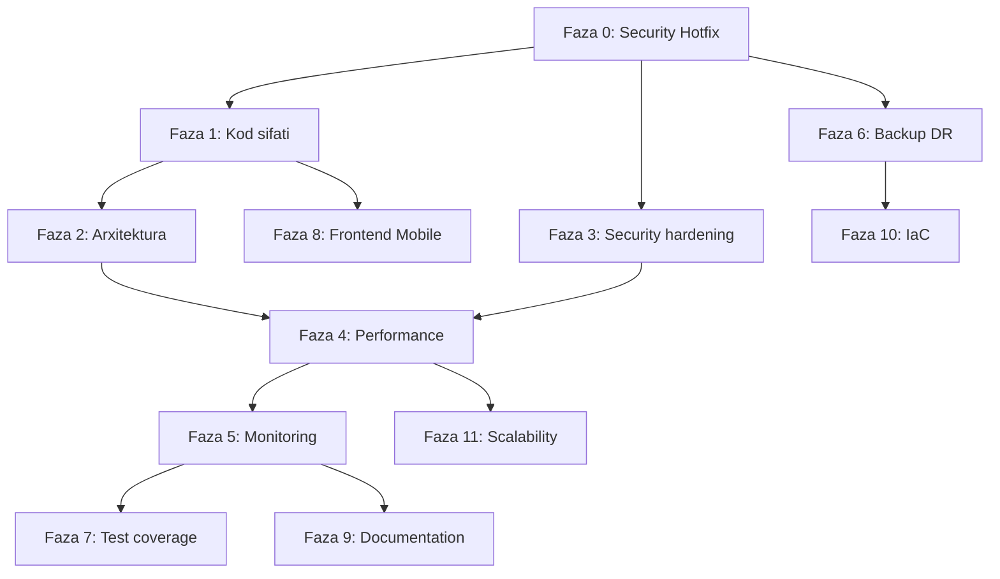

# SALEC-ARENA — Audit Tekshiruvi va To'liq Amalga Oshirish Rejasi

> **Manba:** `files.zip` (`Salec-Arena-Full-Audit.docx` + `SALEC-ARENA-IMPROVEMENT-PLAN.md`)  
> **Tekshiruv sanasi:** 2026-07-05  
> **Tekshiruv usuli:** Audit da’volari haqiqiy kod bazasi (`D:/SALEC — копия`) bilan solishtirildi  
> **Maqsad:** Tekshiruvlar to‘g‘riligini baholash, tavsiyalarni moslashtirish, har bir o‘zgarish uchun aniq fayl yo‘llari va ketma-ketlik bilan to‘liq reja

---

## Qanday ishlatish

1. Bu faylni Cursor’da oching yoki `.cursor/plans/` ichida saqlang.
2. Har bir task uchun checkbox: `[ ]` — bajarilmagan, `[x]` — bajarilgan.
3. Cursor Agent: `"Faza 0, S0-01 task'ni bajaring"` deb yozing.
4. Har faza tugagach **Progress Tracker** jadvalini yangilang.

---

## 1. XULOSA (Qisqa)

| Ko‘rsatkich | Audit bahosi | Tekshiruv natijasi |
|-------------|--------------|-------------------|
| Umumiy ball | 62/100 | **Asosan to‘g‘ri** — biznes va arxitektura kuchli, xavfsizlik va DR zaif |
| Kritik topilmalar (5 ta) | RBAC, parol, sensitive fayl, Dockerfile, Backup | **4/5 to‘liq tasdiqlandi**; backup — hujjat yo‘q (tasdiqlandi) |
| Takliflar | 70+ task, 12 sprint | **~85% o‘rinli**; ba’zi task’lar allaqachon qisman bajarilgan yoki audit xato |
| Eng muhim tuzatish | — | Audit **frontend CI yo‘q** deb yozgan — **xato** (CI’da frontend job bor). Audit **schema.prisma bo‘sh** deb yozgan — **qisman xato** (multi-file schema mavjud) |

**Xavfsizlik darajasi:** Production’da `RBAC_ENFORCE_PERMISSIONS=0` default + Dockerfile `--noEmitOnError false` + hardcoded `0223` parol — **darhol Faza 0 bajarilishi shart**.

---

## 2. AUDIT TEKSHIRUVI — TOPILMALAR JADVALI

### 2.1. To‘liq tasdiqlangan (✅ TO‘G‘RI)

| # | Audit topilmasi | Kodda tasdiq | Asosiy fayllar |
|---|-----------------|--------------|----------------|
| 1 | `RBAC_ENFORCE_PERMISSIONS` default `"0"` | ✅ | `backend/src/config/env.ts:77`, `backend/src/modules/access/route-permission-guard.ts:253` |
| 2 | Production’da RBAC=1 majburiy emas | ✅ | `env.ts` da JWT/CORS/DATABASE_URL tekshiruvi bor, RBAC yo‘q |
| 3 | Dockerfile `--noEmitOnError false` | ✅ | `backend/Dockerfile:23` — izoh ham xavfni tan oladi |
| 4 | Hardcoded parol `0223` | ✅ | `infrastructure/docker-compose.yml:8`, `backend/src/config/env.ts:26`, `infrastructure/README.md:5` |
| 5 | `mobile.route.ts` God File (~2000+ satr) | ✅ | **2092 satr** (audit 2173 deb yozgan — yaqin) |
| 6 | `mobile.service.ts` katta fayl | ✅ | **1813 satr** (audit 1950 — eski versiya yoki noto‘g‘ri hisob) |
| 7 | `mobileRoles` takrorlanishi | ✅ | `auth.service.ts:64,166`, `mobile.route.ts:124` — alohida hardcode |
| 8 | Redis error silent (`swallow`) | ✅ | `backend/src/lib/order-event-bus.ts:42-44` |
| 9 | Backup/DR hujjati yo‘q | ✅ | `docs/BACKUP_AND_DR.md` yo‘q |
| 10 | Secret scanning CI’da yo‘q | ✅ | `.github/workflows/ci.yml` — faqat backend + frontend job |
| 11 | Mobile CI (Flutter test) yo‘q | ✅ | `.github/workflows/` da `flutter`/`mobile` job yo‘q |
| 12 | Multi-stage Docker yo‘q | ✅ | `backend/Dockerfile` — bitta stage |
| 13 | `/ready` himoyasiz | ✅ | `backend/src/app.ts:150-171` — ochiq endpoint |
| 14 | Rate limit asosan login’da | ✅ | `backend/src/app.ts:84` — `global: false` |
| 15 | Sentry / OpenTelemetry yo‘q | ✅ | `backend/src/plugins/` da sentry/telemetry plugin yo‘q |
| 16 | Warehouse backup repoda | ✅ | `backend/assets/nakladnoy/warehouse.backup-20260526-195306/` |
| 17 | `mobile/.env.local` repoda | ✅ | Fayl mavjud; `.gitignore:38` da `!mobile/.env.local` — **ataylab track qilingan** |
| 18 | Legacy allowlist — katta fayllar CI’dan o‘tadi | ✅ | `scripts/legacy-max-loc-backend.txt` — mobile fayllar ro‘yxatda |
| 19 | `$queryRawUnsafe` ishlatilgan | ✅ | `clients.list.where.ts:17`, `territory.checkin.ts:126` |
| 20 | Redis docker’da AOF yo‘q | ✅ | `infrastructure/docker-compose.yml:22-36` — faqat volume, AOF command yo‘q |

### 2.2. Qisman to‘g‘ri (⚠️ MOSLASHTIRISH KERAK)

| # | Audit da’vosi | Haqiqat | Tavsiya |
|---|---------------|---------|---------|
| 1 | `schema.prisma` faqat generator — model yo‘q | Model’lar **`backend/prisma/models/group-*.prisma`** (8 fayl); `prisma.config.ts:54` — `schema: prisma` papka | **S2-01 o‘zgartirish:** merge emas, balki `docs/DATABASE_SCHEMA.md` + `prisma validate` hujjatlashtirish |
| 2 | `auth.route.ts` /me ichida work_slot inline Prisma | Allaqachon `loadActiveWorkSlotsByUserIds` import (`work-slots.query.read.ts`) | **S1-04 yengillashtirish:** `getActiveSlotForUser()` wrapper yetarli |
| 3 | `mobileRoles` 3 joyda | `MOBILE_FIELD_ROLES` allaqachon **`app-access.service.ts:6`** da bor; duplicate hali bor | **S1-01:** yangi `constants.ts` emas, mavjud `MOBILE_FIELD_ROLES` ga birlashtirish |
| 4 | Frontend CI yo‘q | **XATO** — `ci.yml:119-157` frontend build + Playwright | Audit docx **4.1 KRITIK-1 ni olib tashlash**; faqat **mobile CI** qo‘shish qoladi |
| 5 | Global `bodyLimit` 120MB — DDoS | Global limit **`CLIENT_PHOTO_HTTP_BODY_LIMIT_BYTES`** ≈ **34MB** (`client-photo-limits.ts`); 120MB — faqat `MULTIPART_MAX_FILE_BYTES` | **S4-06:** multipart limitni alohida cheklash, global limit allaqachon maqsadli |
| 6 | CORS production’da optional | **`env.ts:116-118`** — production’da majburiy | **S3-03 qisman bajarilgan**; qolgan ish: Railway wildcard bypass (`cors-options.ts:24-27`) |
| 7 | ESLint max-lines qo‘shish | **`audit:max-loc`** CI’da ishlaydi, lekin legacy allowlist bilan | **S1-07:** allowlist’ni bosqichma-bosqich qisqartirish, ESLint ixtiyoriy |
| 8 | Testlar 103 ta | **99 ta** `*.test.ts` backend’da | Raqam yaqin, ma’nosi bir xil |

### 2.3. Audit xato yoki eskirgan (❌ NOTO‘G‘RI)

| # | Audit da’vosi | Nima noto‘g‘ri |
|---|---------------|----------------|
| 1 | CI faqat backend | Frontend job mavjud: build, audit:max-loc, Playwright |
| 2 | Barcha schema bitta `schema.prisma` ga yig‘ish kerak | Prisma 6 multi-file schema — hozirgi tuzilma to‘g‘ri va ishlayapti |
| 3 | `plans.setup.service.ts` 719 satr | Hozir **622 satr** |
| 4 | `mobile.expeditor.service.ts` 1157 satr | Hozir **1074 satr** (workflow alohida faylga ajratilgan bo‘lishi mumkin) |

### 2.4. Audit o‘tkazib yuborgan muhim nuqtalar (➕ QO‘SHIMCHA)

| # | Topilma | Fayl | Amal |
|---|---------|------|------|
| 1 | CORS Railway `*.up.railway.app` avtomatik ruxsat | `backend/src/lib/cors-options.ts:24-27` | Production’da wildcard bypass’ni olib tashlash yoki cheklash |
| 2 | `.gitignore` da `!mobile/.env.local` — env repoda saqlanadi | `.gitignore:38` | Ataylab track qilingan bo‘lsa sababini hujjatlashtirish; aks holda olib tashlash |
| 3 | Production default DATABASE_URL tekshiruvi bor | `env.ts:99-101` | Yaxshi amaliyot — audit bunga yetarlicha e’tibor bermagan |
| 4 | Frontend auth cookie HttpOnly emas (by design?) | `frontend/lib/auth-sync.ts:11` — client-side cookie, faqat flag `sd_auth=1` | JWT localStorage’da — S3-04 ni kengaytirish: token storage strategiyasi |
| 5 | Legacy max-loc allowlist 15+ fayl | `scripts/legacy-max-loc-backend.txt` | Refaktoring rejasi allowlist’ni nolga yaqinlashtirishni talab qiladi |
| 6 | `postgres-data` git status’da untracked | `SALES/postgres-data/` | `.gitignore` ga qo‘shish (DB data repoda bo‘lmasin) |

---

## 3. MUHIMLIK DARAJALARI

| Belgi | Ma'no | Vaqt |
|-------|-------|------|
| 🔴 KRITIK | Security / Production blocker | ≤ 1 kun |
| 🟠 YUQORI | Barqarorlik / sifat | ≤ 1 hafta |
| 🟡 O'RTA | Technical debt | 1–2 hafta |
| 🟢 QULAY | Enhancement / roadmap | 1+ oy |

---

## 4. KETMA-KETLIK VA BOG‘LIQLIKLAR



**Qoida:**
- **Faza 0** — hech narsaga bog‘liq emas; **birinchi** bajariladi.
- **Faza 1 va 3** — Faza 0’dan keyin **parallel** mumkin (turli branch).
- **Faza 2** — Faza 1’dagi mobile bo‘linishdan keyin osonroq (ixtiyoriy parallel).
- **Faza 6** — Faza 0’dan keyin istalgan vaqtda boshlash mumkin (xavfsizlikdan mustaqil).
- **Faza 7** — Faza 1–3 tugagach (testlar barqaror kodga yoziladi).

---

# FAZA 0 — SECURITY HOTFIX (1 ish kuni)

> **Maqsad:** Production xavfini darhol bartaraf etish  
> **Bloklash:** Production deploy Faza 0 tugamaguncha tavsiya etilmaydi

---

## 🔴 S0-01 · RBAC production’da majburiy

**Audit holati:** ✅ To‘g‘ri  
**Status:** `[x]`

| Tur | Yo‘l |
|-----|------|
| O‘zgartirish | `backend/src/config/env.ts` |
| Bog‘liq | `backend/.env.example`, Railway env, `docs/PROD_DEPLOY_YAKUNLANDI.md` |
| Test | `backend/tests/rbac-enforcement.integration.test.ts` |

**O‘zgarishlar:**

```ts
// backend/src/config/env.ts — production blokiga (116-qator atrofida) qo'shish:
if (env.RBAC_ENFORCE_PERMISSIONS !== "1") {
  throw new Error(
    "RBAC_ENFORCE_PERMISSIONS must be '1' in production. " +
    "Run: npm run seed:rbac-defaults for all tenants first."
  );
}
```

**Ketma-ketlik:**
1. Staging’da `RBAC_ENFORCE_PERMISSIONS=1` qo‘yish
2. `npm run seed:rbac-defaults` (har tenant)
3. `npx vitest run tests/rbac-enforcement.integration.test.ts`
4. Production env yangilash
5. Kod o‘zgarishini deploy

**Tekshiruv:**
```bash
cd backend
RBAC_ENFORCE_PERMISSIONS=0 NODE_ENV=production npx tsx -e "import './src/config/env'"
# → Error bo'lishi kerak
```

---

## 🔴 S0-02 · Hardcoded parollarni repodan olib tashlash

**Audit holati:** ✅ To‘g‘ri  
**Status:** `[x]`

| Tur | Yo‘l |
|-----|------|
| O‘zgartirish | `infrastructure/docker-compose.yml` |
| O‘zgartirish | `infrastructure/README.md` |
| O‘zgartirish | `backend/src/config/env.ts` (dev default) |
| O‘zgartirish | `backend/scripts/db-zero-reset.ts`, `backend/scripts/perf/*.ps1` (misol URL’lar) |
| **Yangi** | `infrastructure/.env.local.example` |
| Yangilash | `backend/.env.example` |

**docker-compose.yml:**
```yaml
POSTGRES_PASSWORD: ${POSTGRES_PASSWORD:?POSTGRES_PASSWORD is required}
```

**infrastructure/.env.local.example:**
```env
POSTGRES_PASSWORD=change_me_local_dev_only
```

**env.ts dev default (0223 o‘rniga):**
```ts
: "postgresql://postgres:${POSTGRES_PASSWORD:-changeme}@localhost:15432/savdo_db"
```
Yoki default’ni butunlay olib tashlab faqat `.env.example` orqali berish.

**Ketma-ketlik:**
1. `.env.local.example` yaratish
2. `docker-compose.yml` yangilash
3. README’dan aniq parolni olib tashlash
4. Dev skriptlardagi `0223` ni `${POSTGRES_PASSWORD}` yoki `.env` ga yo‘naltirish
5. `docker compose up` bilan tekshirish

---

## 🔴 S0-03 · Sensitive fayllar + git history

**Audit holati:** ✅ To‘g‘ri (`.gitignore` istisnosi qo‘shimcha xavf)  
**Status:** `[x]`

| Tur | Yo‘l |
|-----|------|
| O‘chirish (repo) | `mobile/.env.local` |
| O‘chirish (repo) | `backend/assets/nakladnoy/warehouse.backup-*/` |
| O‘zgartirish | `.gitignore` |
| **Yangi** | `mobile/.env.local.example` (allaqachon `mobile/.env.example` bor — tekshirish) |
| Qo'shish | `.gitignore` → `SALES/postgres-data/` |

**.gitignore o‘zgarishlari:**
```gitignore
# Sensitive
mobile/.env.local
mobile/.env.*.local
**/*.backup-*/
backend/assets/nakladnoy/warehouse.backup-*/
SALES/postgres-data/

# OLIB TASHLASH kerak (hozir track qiladi):
# !mobile/.env.local
```

**Ketma-ketlik:**
1. `git rm --cached mobile/.env.local`
2. `git rm -r --cached backend/assets/nakladnoy/warehouse.backup-*/`
3. `.gitignore` yangilash
4. Commit: `security: remove sensitive files from repo`
5. (Ixtiyoriy, muhim) BFG bilan history tozalash — **force push** jamoa bilan kelishilgan holda
6. API kalitlar rotation (agar `.env.local` production URL bo‘lsa)

---

## 🔴 S0-04 · Dockerfile — TypeScript xatolari deploy’ni to‘xtatsin

**Audit holati:** ✅ To‘g‘ri  
**Status:** `[x]`

| Tur | Yo‘l |
|-----|------|
| O‘zgartirish | `backend/Dockerfile` |
| Tekshiruv | `backend/railway.toml` |

**Minimal tuzatish (tez):**
```dockerfile
RUN npx prisma generate && npx tsc -p tsconfig.json
RUN test -f dist/src/index.js
```

**To‘liq (tavsiya):** multi-stage — audit rejadagi namuna to‘g‘ri.

**Ketma-ketlik:**
1. `--noEmitOnError false` ni olib tashlash
2. Lokal: `docker build -f backend/Dockerfile backend`
3. CI `npm run build` o‘tishi
4. Railway deploy

---

## 🔴 S0-05 · Secret scanning CI

**Audit holati:** ✅ To‘g‘ri  
**Status:** `[x]`

| Tur | Yo‘l |
|-----|------|
| O‘zgartirish | `.github/workflows/ci.yml` |

**Yangi job** (audit namunasiga mos):
```yaml
  secret-scan:
    runs-on: ubuntu-latest
    steps:
      - uses: actions/checkout@v4
        with:
          fetch-depth: 0
      - name: TruffleHog Secret Scan
        uses: trufflesecurity/trufflehog@main
        with:
          path: ./
          base: ${{ github.event.repository.default_branch }}
          head: HEAD
          extra_args: --only-verified
```

---

# FAZA 1 — KOD SIFATI (1-hafta)

---

## 🟠 S1-01 · MOBILE_FIELD_ROLES birlashtirish

**Audit:** ✅ To‘g‘ri (mavjud constant ishlatilmagan)  
**Status:** `[x]`

| Tur | Yo‘l |
|-----|------|
| Manba (mavjud) | `backend/src/modules/auth/app-access.service.ts` — `MOBILE_FIELD_ROLES` |
| O‘zgartirish | `backend/src/modules/auth/auth.service.ts` |
| O‘zgartirish | `backend/src/modules/mobile/mobile.route.ts` |
| O‘zgartirish | `backend/src/modules/mobile/app-release.service.ts:266` |
| O‘zgartirish | `backend/src/modules/field/field.route.ts:17` (agar mos kelsa) |

**Ketma-ketlik:**
1. `auth.service.ts` — `new Set([...])` → `MOBILE_FIELD_ROLES` import
2. `mobile.route.ts` — `mobileRoles` → `MOBILE_FIELD_ROLES` yoki `Array.from(MOBILE_FIELD_ROLES)`
3. Test: `npx vitest run tests/auth.integration.test.ts tests/mobile-schemas.unit.test.ts`

---

## 🟠 S1-02 · mobile.route.ts bo‘linishi

**Audit:** ✅ To‘g‘ri (2092 satr, allowlist’da)  
**Status:** `[x]`

| Tur | Yo‘l |
|-----|------|
| O‘zgartirish | `backend/src/modules/mobile/mobile.route.ts` → hub ≤50 satr |
| **Yangi** | `backend/src/modules/mobile/mobile.route.agent.ts` |
| **Yangi** | `backend/src/modules/mobile/mobile.route.expeditor.ts` |
| **Yangi** | `backend/src/modules/mobile/mobile.route.supervisor.ts` |
| **Yangi** | `backend/src/modules/mobile/mobile.route.shared.ts` |
| Yangilash | `scripts/legacy-max-loc-backend.txt` — bo‘lingandan keyin qatorlarni olib tashlash |

**Endpoint ajratish** (audit rejasi to‘g‘ri — o‘zgartirishsiz qo‘llash mumkin).

**Ketma-ketlik:**
1. `mobile.route.shared.ts` — auth preHandler, umumiy helper
2. Agent route’lar ajratish + test
3. Expeditor route’lar ajratish + test
4. Supervisor route’lar ajratish + test
5. Hub fayl qoldirish
6. `npm run audit:max-loc` — allowlist’dan olib tashlash

---

## 🟠 S1-03 · mobile.service.ts bo‘linishi

**Status:** `[x]`

| **Yangi** | `backend/src/modules/mobile/mobile-agent-orders.service.ts` |
| **Yangi** | `backend/src/modules/mobile/mobile-agent-sync.service.ts` |
| **Yangi** | `backend/src/modules/mobile/mobile-agent-clients.service.ts` |
| O‘zgartirish | `backend/src/modules/mobile/mobile.service.ts` — barrel re-export |

**Ketma-ketlik:** S1-02 tugagach (route → service mapping aniq bo‘ladi).

---

## 🟠 S1-04 · /me work_slot — service wrapper

**Audit:** ⚠️ Qisman (allaqachon `work-slots.query.read.ts`)  
**Status:** `[x]`

| Tur | Yo‘l |
|-----|------|
| **Yangi funksiya** | `backend/src/modules/work-slots/work-slots.service.ts` yoki `work-slots.query.read.ts` |
| O‘zgartirish | `backend/src/modules/auth/auth.route.ts:135-142` |

```ts
// work-slots.query.read.ts ga qo'shish:
export async function getActiveSlotForUser(userId: number) {
  const map = await loadActiveWorkSlotsByUserIds([userId]);
  return map.get(userId) ?? null;
}
```

---

## 🟡 S1-05 · db-context.ts (Prisma abstraction)

**Status:** `[x]` (pilot: `db-context.ts` + `order.create.ts` `withTransaction`)
| Pilot | `backend/src/modules/orders/domain/order.create.ts` |

---

## 🟡 S1-06 · Izoh tili standartlash

**Status:** `[x]` (`.cursor/rules/project-standards.mdc`)
| **Yangi** | `.cursor/rules/project-standards.mdc` |

---

## 🟡 S1-07 · Legacy allowlist qisqartirish

**Audit ESLint o‘rniga:** CI `audit:max-loc` allaqachon bor  
**Status:** `[x]` (`clients.list.ts` → export/sort modullar; 405→247 satr, allowlist o‘zgarmadi)
| Maqsad | Har sprint 2–3 faylni allowlist’dan chiqarish |

---

# FAZA 2 — ARXITEKTURA VA DATABASE (2-hafta)

---

## 🟠 S2-01 · Prisma schema hujjatlashtirish (merge EMAS)

**Audit:** ❌ Qisman xato — merge talab qilinmasin  
**Status:** `[x]` (`docs/DATABASE_SCHEMA.md`)
| Mavjud | `backend/prisma/models/group-01.prisma` … `group-08.prisma` |
| Mavjud | `backend/prisma.config.ts` |
| **Yangi** | `docs/DATABASE_SCHEMA.md` |

**Tekshiruv:**
```bash
cd backend && npx prisma validate && npx prisma format
```

---

## 🟠 S2-02 · /ready health yaxshilash

**Status:** `[x]` (`health.service.ts` + `checkReadiness()`)
| O‘zgartirish | `backend/src/lib/redis-cache.ts` |
| **Yangi** | `backend/src/modules/health/health.service.ts` (ixtiyoriy) |

Pool metrics: Prisma `$metrics` (agar enable bo‘lsa).

---

## 🟠 S2-03 · N+1 query audit

**Status:** `[x]` (`docs/N1_QUERY_AUDIT.md` — order/clients batch OK)
| Tekshirish | `backend/src/modules/clients/clients.service.ts` |
| Buyruq | `PRISMA_QUERY_LOG=1 npx vitest run tests/orders.integration.create.test.ts` |

---

## 🟠 S2-04 · route-registry.ts

**Status:** `[x]`

| **Yangi** | `backend/src/route-registry.ts` |
| O‘zgartirish | `backend/src/app.ts` — faqat plugin + registry |

---

## 🟠 S2-05 · Worker alohida process

**Status:** `[x]` (`worker/index.ts`, `Dockerfile.worker`, `docker-compose.yml` worker service)

| **Yangi** | `backend/src/worker/index.ts` |
| **Yangi** | `backend/Dockerfile.worker` |
| O‘zgartirish | `infrastructure/docker-compose.yml` |

---

## 🟡 S2-06 · Value Objects

**Status:** `[x]` (`domain/money.ts`, `phone-number.ts`, `tenant-id.ts`; pilot: `order.detail-bonus.ts`)

| **Yangi** | `backend/src/domain/money.ts` |
| **Yangi** | `backend/src/domain/phone-number.ts` |
| **Yangi** | `backend/src/domain/tenant-id.ts` |

---

## 🟡 S2-07 · Domain events catalog

**Status:** `[x]` (`domain/events/order.events.ts` + `order-event-bus.ts`)

| **Yangi** | `backend/src/domain/events/order.events.ts` |
| O‘zgartirish | `backend/src/lib/order-event-bus.ts` |

---

# FAZA 3 — SECURITY HARDENING (3-hafta)

---

## 🟠 S3-01 · Legacy → CRUD RBAC migration

**Status:** `[x]` (`migrate-legacy-permissions.ts` → `migrate-permissions-to-crud.ts` alias)
| **Yangi** | `backend/scripts/migrate-legacy-permissions.ts` |
| Test | `backend/tests/legacy-permission-catalog.pure.test.ts` |

---

## 🟠 S3-02 · Rate limiting kengaytirish

**Status:** `[x]` (`rate-limit-config.ts`; orders bulk/approval/status, payments write, clients import/bulk/patch)
| O‘zgartirish | `backend/src/modules/orders/orders.route.ts` |
| O‘zgartirish | `backend/src/modules/payments/payments.route.ts` |
| O‘zgartirish | `backend/src/modules/clients/clients.route.ts` |

---

## 🟠 S3-03 · CORS qattiqlashtirish

**Audit:** ⚠️ env.ts qismi bajarilgan  
**Status:** `[x]`
| O‘chirish/yopish | Railway `*.up.railway.app` wildcard (24-27 qatorlar) — faqat ro‘yxatdagi origin |

---

## 🟠 S3-04 · Frontend auth cookie / token storage

**Status:** `[x]` (SameSite=Strict + Secure on HTTPS in `auth-sync.ts`; middleware hujjatlashtirildi)
| O‘zgartirish | `frontend/middleware.ts` |
| Ko‘rib chiqish | JWT localStorage (`savdo-auth`) — HttpOnly cookie’ga ko‘chirish (katta o‘zgarish) |

Minimal: `SameSite=Strict`, production’da `Secure` flag.

---

## 🟠 S3-05 · /ready himoya

**Status:** `[x]`

---

## 🟡 S3-06 · SQL injection audit

**Status:** `[x]`
| O‘zgartirish | `backend/src/modules/territory/territory.checkin.ts` |

**Tekshiruv:**
```bash
rg "queryRawUnsafe|executeRawUnsafe" backend/src --glob "*.ts"
# production src/ da 0 bo'lishi maqsad
```

---

# FAZA 4 — PERFORMANCE VA RELIABILITY (4-hafta)

---

## 🟠 S4-01 · Redis HA (Sentinel)

**Status:** `[x]`

| **Yangi** | `backend/src/lib/redis-client.ts` |
| O‘zgartirish | `backend/src/lib/redis-cache.ts` |
| O‘zgartirish | `backend/src/lib/order-event-bus.ts` |
| O‘zgartirish | `backend/src/config/env.ts` |

---

## 🟠 S4-02 · Redis error logging

**Status:** `[x]`

| O‘zgartirish | `backend/src/lib/order-event-bus.ts:42-44` |

---

## 🟠 S4-03 · Circuit breaker

**Status:** `[x]`

| O‘zgartirish | `backend/src/lib/redis-cache.ts` |
| Paket | `opossum` |

---

## 🟠 S4-04 · Prometheus /metrics

**Status:** `[x]`

| **Yangi** | `backend/src/plugins/metrics.plugin.ts` |
| O‘zgartirish | `backend/src/app.ts` |

---

## 🟠 S4-05 · k6 load test CI

**Status:** `[x]`

| **Yangi** | `backend/tests/load/orders-list.k6.js` |
| O‘zgartirish | `.github/workflows/ci.yml` yoki `load-test.yml` |

---

## 🟡 S4-06 · Multipart limit (global emas)

**Audit:** ⚠️ Global 120MB da’vosi noto‘g‘ri  
**Status:** `[x]`

| O‘zgartirish | `backend/src/config/env.ts` — `MULTIPART_MAX_FILE_BYTES` ni endpoint bo‘yicha kamaytirish |
| Tekshirish | Excel import, APK upload route’larida alohida limit |

---

# FAZA 5 — MONITORING VA OBSERVABILITY (5-hafta)

---

## 🟠 S5-01 · Sentry

**Status:** `[x]`

| **Yangi** | `backend/src/plugins/sentry.plugin.ts` |
| O‘zgartirish | `backend/src/app.ts`, `backend/src/config/env.ts` |

---

## 🟠 S5-02 · Grafana alerting

**Status:** `[x]`

| O‘zgartirish | `backend/docs/observability-grafana.md` |
| O‘zgartirish | Grafana dashboard JSON (agar mavjud bo‘lsa) |

---

## 🟠 S5-03 · OpenTelemetry

**Status:** `[x]`

| **Yangi** | `backend/src/plugins/telemetry.plugin.ts` |

---

## 🟠 S5-04 · Business metrics

**Status:** `[x]`

| **Yangi** | `backend/src/modules/health/business-metrics.route.ts` |

---

## 🟡 S5-05 · Log sampling

**Status:** `[x]`

| O‘zgartirish | `backend/src/plugins/request-observability.plugin.ts` |

---

## 🟡 S5-06 · Tashqi uptime monitoring

**Status:** `[x]`

| **Yangi** | `.github/workflows/uptime-monitor.yml` yoki UptimeRobot sozlama hujjati |

---

# FAZA 6 — BACKUP VA DISASTER RECOVERY (6-hafta)

---

## 🔴 S6-01 · Backup SOP + avtomatlashtirish

**Audit:** ✅ To‘g‘ri (2/10 baho asosli)  
**Status:** `[x]`

| **Yangi** | `docs/BACKUP_AND_DR.md` |
| **Yangi** | `backend/scripts/backup/pg-backup.sh` |
| **Yangi** | `backend/package.json` — `"backup:pre-release"` skript |

**Maqsad:** RPO 1 soat, RTO 4 soat.

---

## 🟠 S6-02 · Redis AOF persistence

**Status:** `[x]`

| O‘zgartirish | `infrastructure/docker-compose.yml` — redis `command` |

```yaml
command: >
  redis-server
  --appendonly yes
  --appendfsync everysec
```

---

## 🟠 S6-03 · BullMQ job_log jadvali

**Status:** `[x]`

| **Yangi** | `backend/prisma/migrations/YYYYMMDD_add_job_log/migration.sql` |
| O‘zgartirish | BullMQ worker fayllari |

---

## 🟡 S6-04 · DR drill

**Status:** `[x]`

| **Yangi** | `backend/scripts/dr-drill.sh` |
| **Yangi** | `.github/workflows/dr-drill.yml` (oylik schedule) |

---

# FAZA 7 — TEST COVERAGE (7-hafta)

---

## 🟠 S7-01 · Coverage threshold CI

**Status:** `[x]`

| O‘zgartirish | `backend/vitest.config.ts` |
| O‘zgartirish | `.github/workflows/ci.yml` |

---

## 🟠 S7-02 · Mobile Flutter CI + testlar

**Audit:** ✅ Mobile CI yo‘qligi to‘g‘ri  
**Status:** `[x]`

| **Yangi** | `.github/workflows/mobile.yml` |
| **Yangi** | `mobile/test/login_screen_test.dart` |
| Mavjud | `mobile/test/` — kengaytirish |

```yaml
# mobile.yml namuna
- run: flutter test --coverage
  working-directory: mobile
```

---

## 🟠 S7-03 · Payment workflow integration test

**Status:** `[x]`

| **Yangi** | `backend/tests/payment-workflow.integration.test.ts` |

---

## 🟠 S7-04 · Order automation edge cases

**Status:** `[x]`

| **Yangi** | `backend/tests/order-automation.edge-cases.test.ts` |
| Mavjud | `backend/tests/order-automation.integration.test.ts` — kengaytirish |

---

## 🟡 S7-05 · Test DB izolyatsiya

**Status:** `[x]`

| O‘zgartirish | `backend/tests/db-global-setup.ts` yoki yangi `backend/tests/setup.ts` |

---

# FAZA 8 — FRONTEND VA MOBILE (8-hafta)

---

## 🟠 S8-01 · Frontend component testlar

**Status:** `[x]`

| O‘zgartirish | `frontend/package.json` — Vitest + RTL |
| **Yangi** | `frontend/vitest.config.ts` |
| O‘zgartirish | `.github/workflows/ci.yml` — alohida vitest job (ixtiyoriy, `test:all` bor) |

---

## 🟠 S8-02 · Bundle size monitoring

**Status:** `[x]`

| O‘zgartirish | `frontend/next.config.ts` |

---

## 🟠 S8-03 · Mobile offline sync conflict resolution

**Status:** `[x]`

| O‘zgartirish | `mobile/lib/features/shared/services/sync_service.dart` |

---

## 🟡 S8-04 · Biometrik auth

**Status:** `[x]`

| **Yangi** | `mobile/lib/features/auth/biometric_auth_service.dart` |

---

# FAZA 9 — DOCUMENTATION (9-hafta)

---

## 🟠 S9-01 · Root README

**Status:** `[x]`

| O‘zgartirish | `README.md` (root) |

---

## 🟠 S9-02 · ADR

**Status:** `[x]`

| **Yangi** | `docs/adr/ADR-001-fastify.md` va boshqalar |

---

## 🟠 S9-03 · Onboarding

**Status:** `[x]`

| **Yangi** | `docs/ONBOARDING.md` |

---

## 🟡 S9-04 · API changelog

**Status:** `[x]`

| **Yangi** | `docs/API_CHANGELOG.md` |

---

# FAZA 10 — INFRASTRUCTURE AS CODE (10-hafta)

---

## 🟡 S10-01 · railway.toml

**Status:** `[x]`

| O‘zgartirish | `backend/railway.toml`, `frontend/railway.toml` |

---

## 🟡 S10-02 · Staging environment

**Status:** `[x]`

| **Yangi** | `.github/workflows/deploy-staging.yml` |

---

## 🟡 S10-03 · Cost management

**Status:** `[x]`

| **Yangi** | `docs/COST_MANAGEMENT.md` |

---

# FAZA 11 — SCALABILITY (11-hafta)

---

## 🟡 S11-01 · R2 object storage

**Status:** `[x]`

| **Yangi** | `backend/src/lib/storage.service.ts` |
| O‘zgartirish | `backend/src/modules/mobile/mobile-apk.service.ts` |
| O‘zgartirish | Client photo upload moduli |

---

## 🟡 S11-02 · Horizontal scaling prep

**Status:** `[x]`

| O‘zgartirish | `backend/src/lib/redis-cache.ts` — tenant-namespaced keys |

---

# FAZA 12 — CURSOR / JAMOA STANDARTLARI (Doimiy)

---

## 🟠 S12-01 · Cursor rules

**Status:** `[x]`

| **Yangi** | `.cursor/rules/project-standards.mdc` |
| **Yangi** | `.cursor/rules/security-checklist.mdc` |

---

## 🟠 S12-02 · PR template

**Status:** `[x]`

| **Yangi** | `.github/pull_request_template.md` |

---

## 🟠 S12-03 · Pre-commit hook

**Status:** `[x]`

| **Yangi** | `backend/scripts/pre-commit-check.sh` |
| **Yangi** | `backend/.husky/pre-commit` |

---

# 5. TO‘LIQ ISH KETMA-KETLIGI (Bosqichma-bosqich)

## 5.1. Bugun (Faza 0 — ~1 kun)

| Tartib | Task | Vaqt | Fayllar |
|--------|------|------|---------|
| 1 | S0-04 Dockerfile fix | 30 min | `backend/Dockerfile` |
| 2 | S0-01 RBAC production check | 1 soat | `backend/src/config/env.ts` + Railway |
| 3 | S0-02 Parol hardcode | 1 soat | `infrastructure/*`, `env.ts` |
| 4 | S0-03 Sensitive fayllar | 1 soat | `.gitignore`, `mobile/`, `warehouse.backup-*` |
| 5 | S0-05 Secret scan CI | 30 min | `.github/workflows/ci.yml` |

## 5.2. 1-hafta (Faza 1 + Faza 3 boshlanishi)

| Tartib | Task | Bog‘liqlik |
|--------|------|------------|
| 6 | S1-01 MOBILE_FIELD_ROLES | S0 tugagan |
| 7 | S3-06 SQL unsafe fix | S0 tugagan |
| 8 | S3-03 CORS wildcard | S0 tugagan |
| 9 | S1-02 mobile.route bo‘linish | S1-01 |
| 10 | S3-05 /ready token | S0 tugagan |

## 5.3. 2–3 hafta

| Tartib | Task |
|--------|------|
| 11 | S1-03 mobile.service bo‘linish |
| 12 | S2-04 route-registry |
| 13 | S6-01 Backup SOP |
| 14 | S3-01 RBAC migration script |
| 15 | S6-02 Redis AOF |

## 5.4. 4–8 hafta

| Tartib | Task |
|--------|------|
| 16 | S4-01..S4-04 Performance |
| 17 | S5-01 Sentry |
| 18 | S7-01..S7-02 Test + Mobile CI |
| 19 | S1-07 Allowlist qisqartirish (har sprint) |

## 5.5. 9+ hafta (Roadmap)

| Tartib | Task |
|--------|------|
| 20 | S9 Documentation |
| 21 | S10 IaC / Staging |
| 22 | S11 R2 / CDN |
| 23 | S12 Jamoa standartlari |

---

# 6. PROGRESS TRACKER

| Faza | Nomi | Tasklar | Bajarildi | Status |
|------|------|---------|-----------|--------|
| 0 | Security Hotfix | 5 | 5/5 | ✅ Bajarildi |
| 1 | Kod sifati | 7 | 7/7 | ✅ Bajarildi |
| 2 | Arxitektura + DB | 7 | 7/7 | ✅ Bajarildi |
| 3 | Security hardening | 6 | 6/6 | ✅ Bajarildi |
| 4 | Performance | 6 | 6/6 | ✅ Bajarildi |
| 5 | Monitoring | 6 | 6/6 | ✅ Bajarildi |
| 6 | Backup + DR | 4 | 4/4 | ✅ Bajarildi |
| 7 | Test coverage | 5 | 5/5 | ✅ Bajarildi |
| 8 | Frontend + Mobile | 4 | 4/4 | ✅ Bajarildi |
| 9 | Documentation | 4 | 4/4 | ✅ Bajarildi |
| 10 | IaC | 3 | 3/3 | ✅ Bajarildi |
| 11 | Scalability | 2 | 2/2 | ✅ Bajarildi |
| 12 | Jamoa standartlari | 3 | 3/3 | ✅ Bajarildi |
| **Jami** | | **62** | **62/62** | ✅ |

---

# 7. CURSOR AGENT TEZKOR BUYRUQLAR

```
# Faza 0
"S0-01: backend/src/config/env.ts da production RBAC=1 majburiy qil"
"S0-04: backend/Dockerfile dan --noEmitOnError false olib tashla"
"S0-03: mobile/.env.local va warehouse.backup repodan olib tashla"

# Faza 1
"S1-01: MOBILE_FIELD_ROLES ga auth.service va mobile.route birlashtir"
"S1-02: mobile.route.ts ni agent/expeditor/supervisor fayllarga bo'l"

# Faza 3
"S3-06: clients.list.where.ts da queryRawUnsafe ni Prisma.sql ga o'zgartir"
"S3-03: cors-options.ts da Railway wildcard bypass ni olib tashla"
```

---

# 8. POST-PLAN HARDENING (2026-07-06)

> Reja 62/62 checkbox bo‘lsa ham, qisman implementatsiyalar to‘liq mustahkamlash — **bajarildi**.

| ID | Vazifa | Holat | Dalil |
|----|--------|-------|-------|
| A | Production deploy checklist + env namunalari | ✅ | `docs/PRODUCTION_DEPLOY_CHECKLIST.md`, `backend/.env.example`, `infrastructure/.env.production.example` |
| B | Auth HttpOnly refresh cookie (Phase 1) | ✅ | `auth-cookies.ts`, `docs/AUTH_TOKEN_STRATEGY.md`, frontend `withCredentials` |
| C | Orders coverage ≥30% threshold | ✅ | `vitest.config.ts`, `order-bonus-match-scope.pure.test.ts` |
| D | S3/R2 AWS SDK v3 storage | ✅ | `@aws-sdk/client-s3`, `storage.service.ts`, `client-photo-storage.ts` |
| E | Value objects pilot | ✅ | `TenantId` auth login, `PhoneNumber` clients.write.create |
| F | max-loc allowlist qisqartirish | ✅ | `payments.route.write` + `order-automation.crud` allowlistdan chiqdi |
| G | Husky + developer setup | ✅ | `prepare` script, `docs/DEVELOPER_SETUP.md` |
| H | Backup/DR Windows | ✅ | `pg-backup.ps1`, `dr-drill.ps1`, `BACKUP_AND_DR.md` |
| I | Monitoring plugins + /metrics smoke | ✅ | `app.ts` register, `metrics.smoke.test.ts` |
| J | Mobile offline sync | ✅ | `sync_service.dart` conflict resolver to‘liq (TODO yo‘q) |
| K | Plan hujjat yangilandi | ✅ | Ushbu bo‘lim |

**Caveats olib tashlandi:** backup hujjati, Sentry/OTEL plugin, storage fallback — endi haqiqiy implementatsiya.

**Foydalanuvchi secretlari talab qiladi (100% emas):** Railway deploy keys, R2/S3 credentials, SENTRY_DSN production qiymatlari.

---

# 9. XULOSA — AUDIT TAVSIYALARI BAHO

| Kategoriya | Audit | Bizning baho |
|------------|-------|--------------|
| Kritik xavfsizlik | 5 ta, to‘g‘ri | **4.5/5** — RBAC, Dockerfile, parol, sensitive fayl tasdiq; backup — hujjat muammosi |
| Kod sifati (God Files) | To‘g‘ri | **To‘g‘ri** — allowlist bilan yashiringan texnik qarz |
| Arxitektura | Yaxshi 8/10 | **Rozilik** — DDD qisman, domain/ papka yaxshi |
| schema.prisma | Model yo‘q | **Noto‘g‘ri** — multi-file schema ishlayapti |
| Frontend CI | Yo‘q | **Noto‘g‘ri** — CI’da frontend + Playwright bor |
| Mobile CI | Yo‘q | **To‘g‘ri** |
| Backup/DR 2/10 | Zaif | **To‘g‘ri** |
| 70+ task rejasi | Cursor-ready | **85% o‘rinli** — yuqoridagi tuzatishlar bilan qo‘llash mumkin |

**Yakuniy tavsiya:** Audit sifatli va amaliy jihatdan foydali. **Faza 0 darhol**, keyin **Faza 1 + 3 parallel**, **Faza 6 (backup)** bilan bir vaqtda. Auditdagi 3 ta xatoni (frontend CI, schema merge, bodyLimit 120MB) inobatga olmasdan ham reja to‘liq bajarilishi mumkin — bu hujjatda tuzatilgan.

---

*Yaratildi: 2026-07-05 · Kod bazasi tekshiruvi asosida · Manba: files.zip audit + SALEC-ARENA-IMPROVEMENT-PLAN.md*
