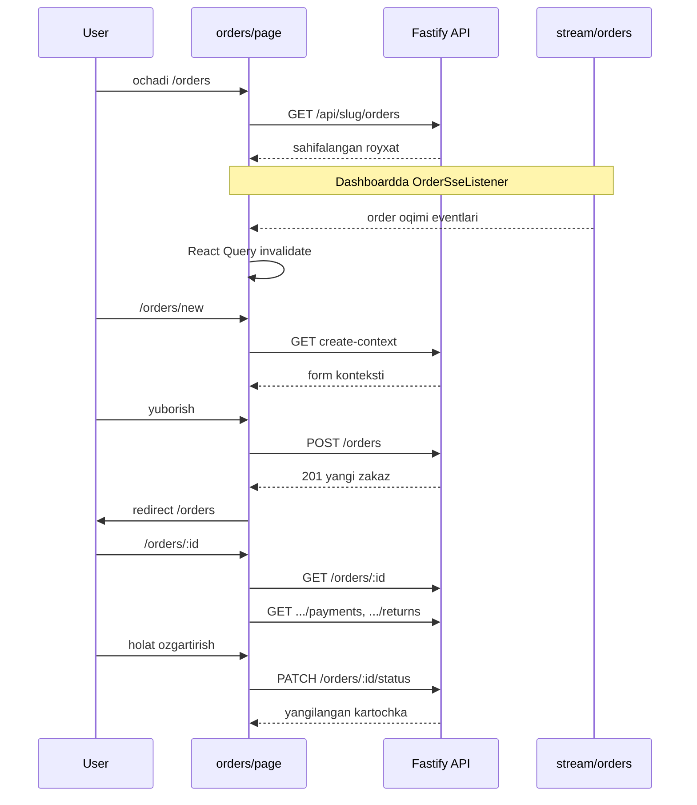

# Buyurtmalar (Orders) moduli — API va UI oqimi

Bu hujjat SALEC kod bazasidagi **buyurtmalar** yadrosi bo‘yicha ketma-ketlikni qisqacha bog‘laydi: qaysi REST endpointlar qayerda chaqiriladi, qaysi sahifalar va komponentlar ishtirok etadi, qaysi qo‘shni modullar (to‘lov, qaytarish) ulanadi.

Batafsil holat mashinasi: [ORDER_STATUS.md](./ORDER_STATUS.md). Umumiy endpointlar ro‘yxati: [API-reference.md](./API-reference.md).

---

## 1. Backend: asosiy marshrutlar

Barcha marshrutlar tenant kontekstida: prefix `GET|POST|PATCH /api/:slug/...`. Ro‘yxat [`backend/src/modules/orders/orders.route.ts`](../backend/src/modules/orders/orders.route.ts) dan.

| Metod | Yo‘l | Vazifa | Prehandler (qisqa) |
|--------|------|--------|---------------------|
| GET | `/api/:slug/orders` | Sahifalangan ro‘yxat, filtrlash (`page`, `limit`, `status`, `client_id`, ombor, agent, sana, …) | JWT + skladchik entitlement |
| GET | `/api/:slug/orders/create-context` | Yangi buyurtma formasi uchun kontekst (mijozlar, omborlar, …) | JWT + rollar yoki skladchik |
| GET | `/api/:slug/orders/exchange-source-availability` | Almashtirish uchun manba zakazlar qoldig‘i | JWT + katalog rollari |
| GET | `/api/:slug/orders/:id` | Bitta buyurtma kartasi (qatorlar, meta, loglar maydonlari) | JWT + skladchik entitlement |
| PATCH | `/api/:slug/orders/:id/meta` | Ombor, agent, ekspeditor, izoh, to‘lov usuli, blok | JWT + operator rollari yoki meta entitlement |
| PATCH | `/api/:slug/orders/:id` | Qatorlarni yangilash (mahsulot/qty, bonus, …) | JWT + `ADMIN_AND_OPERATOR_LIKE` |
| PATCH | `/api/:slug/orders/:id/status` | Holat o‘tkazish | JWT + operator rollari |
| POST | `/api/:slug/orders` | Yangi buyurtma/qaytarish/almashtirish yaratish (`order_type`, `items`, …) | JWT + operator rollari |
| POST | `/api/:slug/orders/bulk/status` | Ko‘p zakaz holati | JWT + operator rollari |
| POST | `/api/:slug/orders/bulk/expeditor` | Ko‘p zakazga ekspeditor | JWT + operator rollari |
| POST | `/api/:slug/orders/bulk/nakladnoy` | Nakladnoy eksport (xlsx/pdf) | JWT + rollar yoki skladchik |

**Real-time:** `GET /api/:slug/stream/orders` — SSE, JWT query `access_token` yoki `Authorization`. Kod: [`backend/src/modules/orders/order-stream.route.ts`](../backend/src/modules/orders/order-stream.route.ts). Redis yo‘q bo‘lsa ham jarayon ichida ishlaydi; Redis bilan `order-events` orqali ko‘p instans.

---

## 2. Qo‘shni modullar (buyurtma kartasida UI chaqiradi)

| Metod | Yo‘l | Modul | UI manbasi |
|--------|------|--------|------------|
| GET | `/api/:slug/orders/:id/payments` | [`payments.route.ts`](../backend/src/modules/payments/payments.route.ts) | `order-detail-view.tsx` |
| GET | `/api/:slug/orders/:id/returns` | [`sales-returns.route.ts`](../backend/src/modules/returns/sales-returns.route.ts) | `order-detail-view.tsx` |

---

## 3. Frontend: App Router sahifalari

| URL | Fayl | Mazmun |
|-----|------|--------|
| `/orders` | [`frontend/app/(dashboard)/orders/page.tsx`](../frontend/app/(dashboard)/orders/page.tsx) | Ro‘yxat, filtrlar, tanlangan zakazlarda bulk holat/ekspeditor, nakladnoy |
| `/orders/new` | [`frontend/app/(dashboard)/orders/new/page.tsx`](../frontend/app/(dashboard)/orders/new/page.tsx) | `OrderCreateWorkspace` (`?type=order|return|…`) |
| `/orders/[id]` | [`frontend/app/(dashboard)/orders/[id]/page.tsx`](../frontend/app/(dashboard)/orders/[id]/page.tsx) | `OrderDetailView` |
| `/orders/[id]/history` | [`frontend/app/(dashboard)/orders/[id]/history/page.tsx`](../frontend/app/(dashboard)/orders/[id]/history/page.tsx) | `OrderHistoryView` (asosan `GET .../orders/:id` dagi loglar) |

Navigatsiya va ikonlar: [`frontend/components/dashboard/nav-config.ts`](../frontend/components/dashboard/nav-config.ts), [`app-shell.tsx`](../frontend/components/dashboard/app-shell.tsx).

---

## 4. Asosiy komponentlar va API chaqiruvlari

| Komponent | Fayl | Asosiy so‘rovlar |
|-----------|------|-------------------|
| Ro‘yxat | `orders/page.tsx` | `GET /orders?…`, `PATCH …/orders/:id/status`, `POST …/bulk/expeditor`, `POST …/bulk/status`, `DELETE` (agar qator ichida bo‘lsa — faylda `orders/${id}`) |
| Yaratish | `order-create-workspace.tsx` | `GET …/orders/create-context`, `GET …/orders?client_id=…`, `POST …/orders` |
| Almashtirish paneli | `exchange-order-create-panel.tsx` | `GET …/orders/exchange-source-availability` |
| Detal | `order-detail-view.tsx` | `GET …/orders/:id`, `GET …/orders/:id/payments`, `GET …/orders/:id/returns`, `PATCH …/status`, `PATCH …/meta`, `PATCH …/orders/:id` (qatorlar) |
| Tarix | `order-history-view.tsx` | `GET …/orders/:id` (status_logs, change_logs) |
| Nakladnoy yordamchi | `lib/order-nakladnoy.ts` | `POST …/orders/bulk/nakladnoy` |
| SSE | `order-sse-listener.tsx` | Avval `GET …/protected` (token yangilash), keyin `EventSource` → `/api/:slug/stream/orders?access_token=…` |

---

## 5. Mantiqiy ketma-ketlik (foydalanuvchi oqimi)

---

## 6. Noldan shu modulni qayerdan “ulash” kerakligi

1. **Auth + tenant** — barcha ` /api/:slug/...` lar `tenant` va JWT dan keyin.
2. **Reference + product + price** — `POST /orders` va qator patch narx/ombor tekshiruviga bog‘liq.
3. **Clients, stock** — kredit limiti, `INSUFFICIENT_STOCK` va boshqalar.
4. **Order status** — `PATCH …/status` va servisdagi o‘tish qoidalari.
5. **Payments / returns** — kartochkada to‘liq tasvir uchun alohida modullar.
6. **SSE** — ro‘yxatni yangilash uchun `order-event-bus` emitlari servis ichida chaqirilishi kerak.

---

## 7. Tekshiruv

Backend: `npm run test:ci --prefix backend` ichida buyurtmaga tegishli integration testlar mavjud bo‘lishi mumkin (`tests/`). Frontend: smoke `e2e` da `/orders` yo‘llari qamrab olingan — [`frontend/e2e/dashboard-routes-smoke.spec.ts`](../frontend/e2e/dashboard-routes-smoke.spec.ts).
