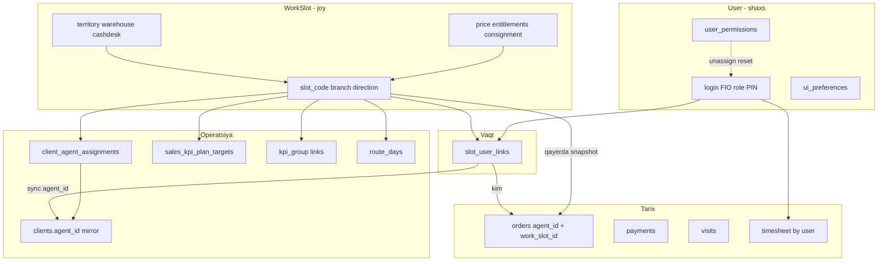

# Reja: Пользователь konfiguratsiyasini → Рабочее место (WorkSlot)

**Sana:** 2026-07-19  
**Maqsad:** Joy doimiy, xodim almashadi. Filial/ombor/kassa/hudud/narx/mijozlar/reja — **slot**da; login/PIN/shaxs — **user**da.

---

## 1. Qoida (bitta jumla)

| Qatlam | Nima |
|--------|------|
| **User (xodim)** | Kimligi: login, parol, FIO, rol, telefon, PIN, shaxsiy UI, sessiyalar, shaxsiy ruxsatlar |
| **WorkSlot (joy)** | Nima ishlaydi: filial, yo‘nalish, hudud, ombor, kassa, narx turlari, entitlements, konsignatsiya limithi joy uchun, mijozlar bog‘lanishi, KPI/plan «joy» siyosati |
| **Harakat / tarix** | Zakaz, to‘lov, tashrif, tabel — **kim qilgan** (`agent_id` / `user_id`) + ixtiyoriy **qaysi joyda** snapshot (`work_slot_id`) |

Almashtirishda: slot konfiguratsiyasi **qoladi**, faqat `slot_user_links` o‘zgaradi; mijozlar (qulflanmagan) yangi agentga o‘tadi; shaxsiy ekstra ruxsatlar tozalanadi.

---

## 2. Hozirgi holat (muammo)

### WorkSlot da bor
- `slot_code`, `label`, `branch_code`, `direction_id`, `slot_type`
- `slot_user_links` / audit
- `client_agent_assignments.work_slot_id` (qisman)

### Hali User da (joyga tegishli, lekin shaxsga yozilgan)
`User` maydonlari (`group-01.prisma`):

| Maydon | Nima uchun joyga |
|--------|------------------|
| `branch` | Filial |
| `trade_direction` / `trade_direction_id` | Yo‘nalish |
| `territory` | Hudud (zona/oblast/shahar) |
| `warehouse_id`, `return_warehouse_id` | Ombor |
| `price_type`, `agent_price_types` | Narx |
| `agent_entitlements` | Mahsulot/narx cheklovlari |
| `consignment*` | Konsignatsiya limithi (joy limithi) |
| `warehouse_staff_entitlements` | Skladchik panel |
| `expeditor_assignment_rules` | Dastavchik qoidalari |
| `supervisor_user_id` | Ustavi (jamoa/joy) |
| `kpi_color` | KPI vizual (ixtiyoriy joy) |
| `code` (agent kodi) | Amalda ko‘pincha slot kodi bilan chalkash |

### User da bog‘lanish jadvallari (joyga ko‘chirish kerak)
| Jadval | Hozir | Maqsad |
|--------|-------|--------|
| `warehouse_user_links` | user ↔ ombor | `warehouse_slot_links` yoki slot ustida FK |
| `cash_desk_user_links` | user ↔ kassa | `cash_desk_slot_links` yoki slot.cash_desk_id |
| `kpi_group_agents` | KPI guruh ↔ user | KPI guruh ↔ **slot** (+ sync faol userga) |
| `sales_kpi_plan_targets.user_id` | reja ↔ user | reja ↔ **slot** (yoki dual: slot asosiy, user mirror) |
| `clients.agent_id` | mijoz ↔ user | operatsion: faol slot userga sync; manba: assignment.work_slot_id |
| `client_agent_assignments` | agent_id + work_slot_id | **work_slot_id** manba; agent_id = faol link sync |
| `agent_route_days` | marshrut kunlari user | marshrut → slot |

### Hozirgi «yolg‘on» slot sozlamasi
`work-slots.user-attrs.ts` → `patchActiveUserOnSlot`: UI slotni tahrirlaganda **faol User**ga yozadi.  
Natija: swap qilinsa konfiguratsiya odamda qoladi yoki chalkashadi — **bu asosiy qarz**.

### Tarix / fakt (userda qolishi KERAK, lekin snapshot qo‘shiladi)
| Jadval | Qoladi | Qo‘shimcha |
|--------|--------|------------|
| `orders.agent_id` | kim yaratgan | `orders.work_slot_id` snapshot |
| `payments.ledger_agent_id` | hisob | ixtiyoriy `work_slot_id` |
| `agent_visits` | kim kelgan | ixtiyoriy slot |
| `timesheet` overrides | shaxs bo‘yicha | chiqish sanasi slot linkdan (allaqachon) |

### Allaqachon qilingan (shu suhbat / oldingi)
- Swap: mijoz migrate + lock
- Plan siyosati FULL/prorata (`work_slots.plan_policy`)
- Tabel: ketgan past+qizil, leave lock
- Unassign: shaxsiy permission reset
- Debt: workplace agent bo‘yicha undirish (`client-debt-by-agent`)

---

## 3. Maqsad modeli

```
WorkSlot (config source of truth)
  ├── branch_code, direction_id          [bor]
  ├── territory_zone/oblast/city         [YANGI]
  ├── warehouse_id, return_warehouse_id  [YANGI]
  ├── cash_desk_id (yoki M:N link)       [YANGI]
  ├── price_type, agent_price_types      [YANGI JSON]
  ├── entitlements JSON                  [YANGI]
  ├── consignment_*                      [YANGI]
  ├── supervisor_slot_id yoki user_id    [YANGI — qaror]
  ├── slot_code = tashqi «agent kodi»    [bor]
  └── SlotUserLink → User (vaqtinchalik odam)

User (person)
  ├── login, password, FIO, role, phone
  ├── ui_preferences, max_sessions, devices
  └── user_permissions (shaxsiy; unassign da tozalanadi)

Runtime resolve:
  activeUser = link(slot).user
  effectiveConfig = slot.*   // UI/mobil shu yerdan
  clients.agent_id = activeUser.id  // sync mirror
```

---

## 4. Bog‘lanishlar grafigi (to‘liq)



---

## 5. Nima Userda QOLADI (ko‘chirmaymiz)

- `login`, `password_hash`, `name` / FIO, `role`, `is_active`
- `phone`, `email`, `pinfl`, `apk_version`, `device_name`, `last_sync_at`
- `max_sessions`, `can_authorize`, `app_access`
- `ui_preferences`
- `user_permissions` / `user_roles` (shaxs; slotdan chiqganda reset)
- Refresh tokenlar, FCM, shaxsiy audit
- Tabel yozuvlari (shaxs ishtiroki)
- Tarixiy `orders.agent_id` (o‘zgartirmaymiz — faqat yangi snapshot)

---

## 6. Bosqichma-bosqich reja

### P0 — Slot konfiguratsiya manbasi (asos)

**DB migratsiya `work_slots` ga:**
- `territory` yoki `territory_zone`, `territory_oblast`, `territory_city`
- `warehouse_id`, `return_warehouse_id`
- `cash_desk_id` (1:1 agent/collector uchun yetarli; keyin M:N)
- `price_type` + `price_types` JSON
- `entitlements` JSON (`agent_entitlements` o‘rniga)
- `consignment`, `consignment_limit_amount`, close schedule maydonlari
- `supervisor_user_id` (vaqtincha user FK; keyin slot-to-slot)
- ixtiyoriy: `config_json` catch-all

**Kod:**
1. `patchWorkSlot` — configni **slot**ga yozadi (endi `patchActiveUserOnSlot` o‘rniga).
2. `assignUserToSlot` / swap oxirida: **slot → faol user mirror** (dual-write o‘qish uchun eski kod sinmasin):
   - `user.branch`, `territory`, `warehouse_id`, `price_type`, `agent_entitlements`, …
3. Unassign: user dagi joy maydonlarini **tozalash** (yoki null) + permission reset (bor).
4. Mobil `agent-config`: avval slot config, yo‘q bo‘lsa user fallback.
5. Backfill: har faol `slot_user_link` uchun user maydonlaridan slotga nusxa.

**UI:** `/work-slots/[id]` — «Конфигурация» faqat slot; staff kartasida joy maydonlari read-only «slotdan» yoki yashirin.

**Qabul:** slot sozlamasi → boshqa agent assign → yangi agentda ombor/hudud/narx shu; eski agentda yo‘qoladi.

---

### P1 — Bog‘lanishlar slotga

| # | Bog‘lanish | Ish |
|---|------------|-----|
| 1 | Mijozlar | `work_slot_id` majburiy manba; `agent_id` faqat sync; UI filtr «по месту» |
| 2 | Ombor | slot.warehouse_id; `WarehouseUserLink` sync yoki o‘chirib slot FK |
| 3 | Kassa | slot.cash_desk_id; `CashDeskUserLink` sync |
| 4 | KPI plan | `SalesKpiPlanTarget.work_slot_id` (+ unique plan+slot); hisobda slot occupancy + plan_policy |
| 5 | KPI guruh | `KpiGroupSlot` yoki target orqali |
| 6 | Marshrut kunlari | `agent_route_days` → `slot_route_days` |
| 7 | Orders | yangi zakazda `work_slot_id` = faol slot (snapshot) |
| 8 | Debt/undirish | allaqachon workplace; filtrlarni slot bo‘yicha yopish |

**Dual-write davri:** yozish slot + mirror user; o‘qish: slot birinchi.

---

### P2 — To‘liq cutover + tozalash

1. Barcha o‘qishlar faqat slot config.
2. User dagi joy maydonlarini deprecated (yozish taqiqlash).
3. Staff create: majburiy `work_slot_id` (field staff).
4. Frontend: agent «Конфигурации» → redirect/slot editor.
5. Hisobotlar: «по месту» / «по сотруднику» ikki o‘q.
6. Eski `patchActiveUserOnSlot` olib tashlash.

---

## 7. Migratsiya / backfill ketma-ketligi

```text
1. Migrate: ALTER work_slots (+ yangi ustunlar)
2. backfill:work-slots-config-from-users
   - faol link bo‘lgan har slot: user.* → slot.*
3. Dual-write yoqish (assign + patch slot)
4. Mobil/API o‘qishni slot-first qilish
5. KPI/plan jadvaliga work_slot_id + backfill
6. orders.work_slot_id snapshot
7. Monitoring 1–2 hafta
8. User joy maydonlariga yozishni o‘chirish
```

Skriptlar (reja):
- `npm run backfill:work-slots` (bor — slot yaratish)
- `npm run backfill:work-slots-config` (yangi)
- `npm run backfill:plan-targets-to-slots` (P1)

---

## 8. API / UI o‘zgarishlar (qisqa)

| Joy | O‘zgarish |
|-----|-----------|
| `PATCH /work-slots/:id` | territory, warehouse, cash_desk, prices, entitlements |
| `POST .../assign` | slot→user mirror + client migrate (bor) |
| `GET mobile/agent-config` | config from slot |
| Staff agent form | joy maydonlari slotga bog‘liq |
| `/work-slots/[id]` | to‘liq konfiguratsiya tab |
| Plans setup | target tanlash: slot (kod) |

---

## 9. Xavflar va himoya

| Xavf | Himoya |
|------|--------|
| Tarixiy zakaz chalkashishi | `agent_id` o‘zgarmaydi; faqat yangi `work_slot_id` |
| Mid-month plan | `plan_policy` (bor) + target slotga o‘tgach occupancy |
| Qulflangan mijoz | `lock_type` manual/contract — migrate skip (bor) |
| Kassa conflict | checklist + bitta collector (bor) |
| Extra permissions leak | unassign/swap reset (bor) |
| Backfill noto‘g‘ri | dry-run + tenant bo‘yicha; faqat faol link |

---

## 10. Test rejasi (har bosqich)

**P0**
1. Slotga ombor/hudud yozish → DB `work_slots` da.
2. A→B swap → B da shu ombor; A da yo‘q (tozalangan).
3. Mobil config B da yangi qiymatlar.
4. Smoke: `npx.cmd tsx scripts/smoke-slot-plan-policy.ts`

**P1**
5. Plan target slot bo‘yicha; swap FULL/prorata.
6. Yangi order da `work_slot_id` to‘ldi.
7. Debt undirish joriy slot agentida.

**P2**
8. Staff formdan joy maydonini o‘zgartirib bo‘lmasligi.
9. Regressiya: work-slots integration + debt tests.

---

## 11. Vaqt / tartib (tavsiya)

| Bosqich | Mazmun | Taxmin |
|---------|--------|--------|
| **P0** | Slot config ustunlari + dual-write + UI slot editor + backfill | 1-chi to‘liq sprint |
| **P1** | Mijoz/ombor/kassa/KPI/order snapshot | 2-chi |
| **P2** | Cutover, user maydonlarini yopish, hisobotlar | 3-chi |

---

## 12. Keyinga (eslatma — hozir qilmaymiz)

Oldin kelishilgan takliflar: swap checklist UI, 24h grace, Slot vs Agent KPI alohida ekran, permission diff audit UI, debt akt, sim suite.

---

## 13. Birinchi implementatsiya qadami (P0 boshlanganda)

1. Prisma: `work_slots` kengaytirish  
2. `patchWorkSlot` + backfill script  
3. Assign oxirida `mirrorSlotConfigToUser`  
4. Unassign: `clearWorkplaceFieldsOnUser`  
5. `patchActiveUserOnSlot` ni deprecated qilish  
6. FE slot detail konfiguratsiya  

**Tayyor degan mezon:** yangi agentni bo‘sh slotga qo‘yganda barcha joy sozlamalari slotdan keladi; eski agentda joy konfiguratsiyasi qolmaydi.

---

## 14. Ta’sir / konflikt / qo‘shilishlar — TO‘LIQ RO‘YXAT

### A) Nimalarga TA’SIR qiladi (modullar)

| # | Modul / zona | Nima o‘zgaradi | Xavf |
|---|--------------|----------------|------|
| 1 | **WorkSlot CRUD** (`work-slots.service`, route, FE `/work-slots`) | Config manbasi User→Slot | O‘rta |
| 2 | **Staff / agent forma** (`staff.crud.*`, agent kartochka, «Конфигурации») | Joy maydonlari slotga ko‘chadi yoki sync | Yuqori |
| 3 | **Assign / swap / unassign** | Mirror slot→user; unassign tozalash | Yuqori |
| 4 | **Mobil agent-config** (`mobile.route.agent.config`, `mobile.service`) | Config o‘qish slot-first | Yuqori |
| 5 | **Zakaz yaratish** (`orders`, `order-create-context`, linkage) | Ombor/narx/entitlement slotdan; `work_slot_id` snapshot | Yuqori |
| 6 | **Mijozlar / assignment** (`clients`, `client-agent-assignments`) | `work_slot_id` manba; agent_id mirror | Yuqori |
| 7 | **Qarz / balans** (`client-debt-by-agent`, finance debts) | Workplace allaqachon; filtr «по месту» | O‘rta |
| 8 | **KPI / planlar** (`plans.*`, `SalesKpiPlanTarget`, daily-kpi, mobile KPI) | Target slotga; occupancy+policy | Yuqori |
| 9 | **KPI guruh** (`KpiGroupAgent`) | User→Slot bog‘lanish | O‘rta |
| 10 | **Ombor** (`WarehouseUserLink`, stock, retail) | Slot.warehouse_id + sync link | Yuqori |
| 11 | **Kassa** (`CashDeskUserLink`, shifts) | Slot.cash_desk_id + conflict | Yuqori |
| 12 | **Konsignatsiya** (`consignment.*`, user consignment_*) | Limit joyda | O‘rta |
| 13 | **Narx / entitlements** (product-prices, agent restrictions) | Slot JSON | Yuqori |
| 14 | **Hudud / geo** (territory, visit planner, map) | Slot territory | O‘rta |
| 15 | **Filial scope** (`work-slots.branch-scope`, payments Q-06) | branch_code slotda (bor) | Past |
| 16 | **Marshrut kunlari** (`agent_route_days`) | → slot_route_days | O‘rta |
| 17 | **Expeditor / skladchik rules** | Slot type bo‘yicha config | O‘rta |
| 18 | **Supervisor bog‘lanish** | User→slot jamoa | O‘rta |
| 19 | **Access / permissions** | Unassign reset (bor); joy ruxsatlari emas | Past |
| 20 | **Tabel** | Leave lock (bor); config emas | Past |
| 21 | **Hisobotlar** (agent-orders, visits, WDR, monitoring) | Filtr agent vs slot | O‘rta |
| 22 | **Dashboard** (sales, finance, supervisor) | Scope agent_id → +slot | O‘rta |
| 23 | **Bonus / automation** | Agent match → slot/agent dual | O‘rta |
| 24 | **Import / system-migration / initial-setup** | Agent qatorlari → slot config | Yuqori |
| 25 | **Auth / login payload** | work_slot_id/code (bor); config emas | Past |
| 26 | **Report builder field registry** | Yangi maydonlar `work_slot_*` | Past |

---

### B) KONFLIKT beradigan joylar (logika to‘qnashuvi)

| # | Konflikt | Nima bo‘ladi | Qanday yechamiz |
|---|----------|--------------|-----------------|
| K1 | **Ikki manba:** User.warehouse vs Slot.warehouse | Turli qiymat — mobil/zakaz chalkash | Dual-write davri: **slot g‘olib**; user faqat mirror |
| K2 | **Staff forma + Slot forma** bir maydonni yozadi | Oxirgi yozuv yutadi | Staff joy maydonlarini lock / redirect slotga |
| K3 | **Agent `code` vs `slot_code`** | Hisobotlarda chalkash ID | Tashqi kod = `slot_code`; user.code deprecated yoki = slot |
| K4 | **clients.agent_id vs assignment.work_slot_id** | Turli agent | Swap/migrate: sync qoida; lock — qo‘lda |
| K5 | **KPI plan user_id vs yangi slot_id** | Ikki target / ikki hisob | Unique plan+slot; user mirror yoki faqat slot |
| K6 | **Oy o‘rtasi swap + to‘liq oy reja** | Ikki agent to‘liq plan | `plan_policy` (bor): starter FULL / new PRORATA |
| K7 | **Kassa: 2 collector bir desk** | Conflict checklist | Slot.cash_desk unique aktiv; checklist (bor) |
| K8 | **Ombor: user link + slot FK** | Ortacha ruxsat | Assign: link sync; unassign: user link olib tashlash |
| K9 | **Shaxsiy entitlements vs slot entitlements** | Agent «o‘z» cheklovi | Joy cheklovi slotda; shaxsiy faqat access matrix |
| K10 | **Konsignatsiya qarz shaxsda, limit joyda** | Limit yangi agentga o‘tadi, qarz eski zakazda | Tarixiy order.agent_id saqlanadi; limit slot |
| K11 | **Supervisor_user_id** | Jamoa odamga bog‘liq | Vaqtincha user; keyin supervisor_slot |
| K12 | **Qulflangan mijoz (contract/manual)** | Swapda o‘tmaydi | Mavjud lock; pending review |
| K13 | **Import Excel «agent» qatori** | Eski shablon user maydonlariga yozadi | Import mapper: slot yarat/yangilash |
| K14 | **Backfill: user→slot** | Noto‘g‘ri user → noto‘g‘ri slot | Faqat faol link; dry-run |
| K15 | **Faol link yo‘q slot** | Config bor, ishlovchi yo‘q | Gate: agent ishini blok (bor); config saqlanadi |
| K16 | **Bir user ikki slot** (xato) | Config chalkash | Invariant: 1 aktiv link / user (enforce) |
| K17 | **Permission reset assign da** | Yangi agentning eski shaxsiy grantlari o‘chadi | Kutilgan; UI ogohlantirish |
| K18 | **Hisobot «по агенту» tarix** | Slot o‘zgargach filtr | Dual filtr: agent_id (kim) + work_slot_id (joy) |
| K19 | **Price_type mijoz vs agent** | Client price vs slot price | Mavjud prioritet qoidasi saqlanadi; agent tomoni slotdan |
| K20 | **Expeditor assignment rules** | Dastavchik qoidalari userda | Slot_type=expeditor config |

---

### C) LOGIK qo‘shilishlar (yangi narsalar)

#### C1. DB / schema
- [ ] `work_slots`: territory_*, warehouse_id, return_warehouse_id, cash_desk_id
- [ ] `work_slots`: price_type, price_types JSON, entitlements JSON
- [ ] `work_slots`: consignment_* maydonlari
- [ ] `work_slots`: supervisor_user_id (keyin supervisor_slot_id)
- [ ] `orders.work_slot_id` (nullable FK, indeks)
- [ ] `sales_kpi_plan_targets.work_slot_id` (+ unique)
- [ ] `slot_route_days` (yoki agent_route_days.slot_id)
- [ ] ixtiyoriy: `kpi_group_slots`, `cash_desk_slot_links`, `warehouse_slot_links`
- [ ] `tenant.settings.work_slots.plan_policy` (bor)

#### C2. Backend funksiyalar
- [ ] `mirrorSlotConfigToUser(tx, slotId, userId)`
- [ ] `clearWorkplaceFieldsOnUser(tx, userId)`
- [ ] `resolveEffectiveAgentConfig(tenantId, userId)` — slot-first
- [ ] `getActiveSlotForUser` / `getActiveUserForSlot` (qisman bor)
- [ ] Assign/swap hook: mirror + client migrate + permission reset (qisman bor)
- [ ] Order create: yozish `work_slot_id`
- [ ] Backfill skriptlar: config, plan targets, order snapshot (ixtiyoriy tarix)
- [ ] Invariant tekshiruv: userda ≤1 aktiv slot link
- [ ] `patchActiveUserOnSlot` → deprecated / o‘chirish

#### C3. API
- [ ] Kengaytirilgan `PATCH /work-slots/:id` (config body)
- [ ] `GET /work-slots/:id` — to‘liq config DTO
- [ ] Mobil config — slot maydonlari
- [ ] Plans API — slot_id target
- [ ] Hisobot query — `work_slot_id` filter

#### C4. Frontend
- [ ] Slot detail: to‘liq «Конфигурация» (ombor, kassa, hudud, narx, entitlements, konsignatsiya)
- [ ] Staff agent: joy maydonlari read-only «из рабочего места» yoki yashirish
- [ ] Agent restrictions dialog → slot editorga ko‘chirish
- [ ] Plans setup: agent o‘rniga slot tanlash (yoki ikkalasi dual)
- [ ] Filtrlar: «Рабочее место» select (monitoring, debts, orders)
- [ ] Swap UI ogohlantirish: permission reset + config slotda qoladi

#### C5. Test / skript
- [ ] Unit: mirror / clear / resolveEffectiveConfig
- [ ] Integration: patch slot → assign B → B da ombor; A da yo‘q
- [ ] Smoke kengaytirish (config + swap)
- [ ] Import dry-run

---

### D) TA’SIR QILMAYDI (qo‘l tekkizilmaydi / faqat o‘qish)

- Login/parol/PIN/sessiya
- UI preferences (jadval ustunlari)
- Shaxsiy audit loglar
- Mahsulot katalogi, umumiy spravochniklar
- Pivot/WDR engine (filtr qo‘shilishi mumkin, engine emas)
- Postgres data / Railway deploy jarayoni (alohida)

---

### E) Qisqa xulosa — «nima sindishi mumkin»

1. Agent kartasidan ombor o‘zgartirish → endi slotga yozilmasa, eski odamda qoladi (**K1/K2**).
2. Swap qilib mobil eski omborni ko‘rsatishi (**mobil slot-first bo‘lmasa**).
3. Ikki joyda plan (user + slot) → KPI ikki baravar (**K5**).
4. Import eski shablon → userga yozib slotni e’tiborsiz qoldiradi (**K13**).
5. Hisobotlar faqat `agent_id` bo‘yicha — joy tarixini ko‘rmaydi (**K18**).

**P0 da eng muhim himoya:** bitta yozish manbasi (slot) + mirror + unassign clear + staff forma qulflash.
